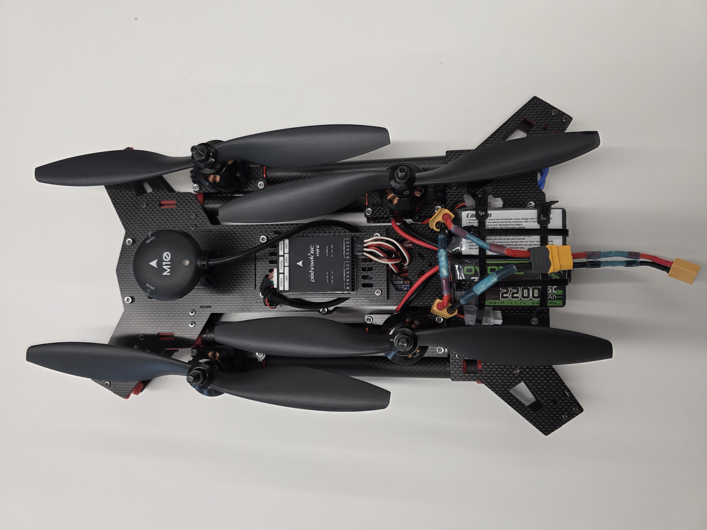
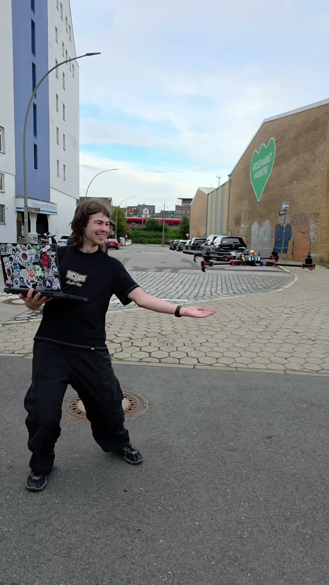

# Annihilation Industries · Warden Core

**A simulation-first robotics project combining learning experiments, computer vision, sensing, physical prototyping and software instrumentation.**

Kian led the project alongside Vincent, Leon and [Constantin](https://github.com/Takane0). Warden Core remains unfinished: the experiments, physical prototype and related sensing study have separate evidence and integration limits.

## What we have built so far

Photographs, digital designs and simulation captures from the project. Click an image to explore its subsystem or watch the recording.

### The physical prototype

<table>
<tr>
<td width="50%" align="center" valign="top">
<a href="subsystems/airframe/README.md"></a>
<p><strong>Open airframe</strong><br>Kian and Constantin worked together on the airframe design.</p>
</td>
<td width="50%" align="center" valign="top">
<a href="subsystems/airframe/README.md"></a>
<p><strong>Folded configuration</strong><br>The same prototype with its arms folded alongside the body.</p>
</td>
</tr>
</table>

### Assembly and landing gear

<table>
<tr>
<td width="50%" align="center" valign="top">
<a href="subsystems/airframe/docs/integration.md"></a>
<p><strong>Assembly and electronics</strong><br>A view inside the build. Constantin handled the Pi–Pixhawk integration and flight-controller programming.</p>
</td>
<td width="50%" align="center" valign="top">
<a href="subsystems/airframe/landing-gear/README.md"></a>
<p><strong>Landing-gear design</strong><br>Kian’s editable LL-11 CAD prototype. This is a digital design, separate from the photographed assembly.</p>
</td>
</tr>
</table>

### Simulation in motion

<table>
<tr>
<td width="50%" align="center" valign="top">
<a href="subsystems/simulation/media/autonomous/corridor-flight.mp4?raw=1"></a>
<p><strong>Autonomous corridor simulation</strong><br>Model-based trajectory control in Isaac Sim. Click to watch the recorded simulation.</p>
</td>
<td width="50%" align="center" valign="top">
<a href="subsystems/simulation/media/simulator/development-montage.mp4?raw=1"></a>
<p><strong>Simulation development reel</strong><br>Camera calibration and mapped-course baseline footage. Click to watch; this is not a trained-policy demonstration.</p>
</td>
</tr>
</table>

### Physical demonstration and sensing research

<table>
<tr>
<td width="50%" align="center" valign="top">
<a href="subsystems/airframe/media/prototype-hover.mp4?raw=1"></a>
<p><strong>Recorded outdoor hover</strong><br>Click to watch the physical prototype. The recording does not document its control mode.</p>
</td>
<td width="50%" align="center" valign="top">
<a href="subsystems/multicamera-sensing/README.md"></a>
<p><strong>Multi-camera sensing study</strong><br>Leon’s related Warden Corps visualization: camera rays meeting in a shared volume. A study, not a deployed network.</p>
</td>
</tr>
</table>

[More photographs and videos](project/media-gallery.md) · [Media provenance](project/evidence/media-provenance.md) · [Vincent’s offline computer-vision experiments](subsystems/perception/docs/experiments.md)

Images retain their existing [media rights](licensing/scopes/media.md) and [presentation-figure exclusions](licensing/scopes/docs-presentations.md).

## Explore by subsystem

Each subsystem contains its own documentation and the public artifacts that belong to it.

| Subsystem | Contributor / workstream | What is inside |
| --- | --- | --- |
| [Simulation and learning](subsystems/simulation/README.md) | Kian | Architecture, training history, reward specifications, evaluation contracts, run identities and simulation footage. |
| [Computer vision](subsystems/perception/README.md) | Vincent | Model explanation, two dated offline experiments, dataset records and known limitations. Private datasets and model artifacts are excluded. |
| [Multi-camera sensing](subsystems/multicamera-sensing/README.md) | Leon | Related Warden Corps study, technical presentation, attributed figures and model limitations. |
| [Airframe and integration](subsystems/airframe/README.md) | Kian and Constantin: joint airframe design; Kian: landing gear; Constantin: Pi–Pixhawk integration and flight-controller programming | Assembly history, prototype photographs and hover footage, landing-leg source, STEP/STL and design checks. |
| [Observability](subsystems/observability/README.md) | Software instrumentation | Runnable Python package, source, tests, synthetic examples and engineering explanation. |

## Project-wide records

[Team contributions](project/team.md) · [History and unfinished work](project/history.md) · [Engineering tour](project/engineering-tour.md) · [Recorded results](project/evidence/README.md) · [Source catalogue](project/evidence/source-records.md) · [Media gallery](project/media-gallery.md)

```text
subsystems/
  simulation/           docs · reward-and-evaluation · results · media
  perception/           docs
  multicamera-sensing/  presentation · figures
  airframe/             docs · landing-gear · media
  observability/        src · tests · examples
project/                team · history · shared evidence · presentations
licensing/              terms · scope notices · model access · third-party notices
tools/                  repository validation
```

Reward specifications belong to the simulation subsystem. All licence notices and access terms are centralized in [licensing](licensing/README.md), with their applicable paths recorded in the [licence map](LICENSE.md).

## Run the public software

The independently runnable component is the [observability package](subsystems/observability/README.md). It records and assesses local timing/resource data; it does not command a vehicle. Its synthetic example deliberately does not produce a hardware pass.

```sh
cd subsystems/observability
python3 -m venv .venv
. .venv/bin/activate
python -m pip install -e '.[dev]'
python -m pytest
```

[Repository checks](tools/README.md) · [Reproducibility](project/reproducibility.md)

## Confidentiality and reuse

**Model weights, checkpoints, optimizer state, embeddings and exported policy binaries remain confidential and closed source. They are not included in this repository.** The [model-access policy](licensing/model-access.md), [commercial terms](licensing/commercial-licensing.md) and [contributor rights](licensing/contributors-and-rights.md) remain in force. Project licences do not grant rights in excluded teammate or third-party material.

[Repository structure](project/repository-structure.md) · [Project scope](project/scope.md) · [Kian Tajbakhsh](https://github.com/Kian-hdr)
