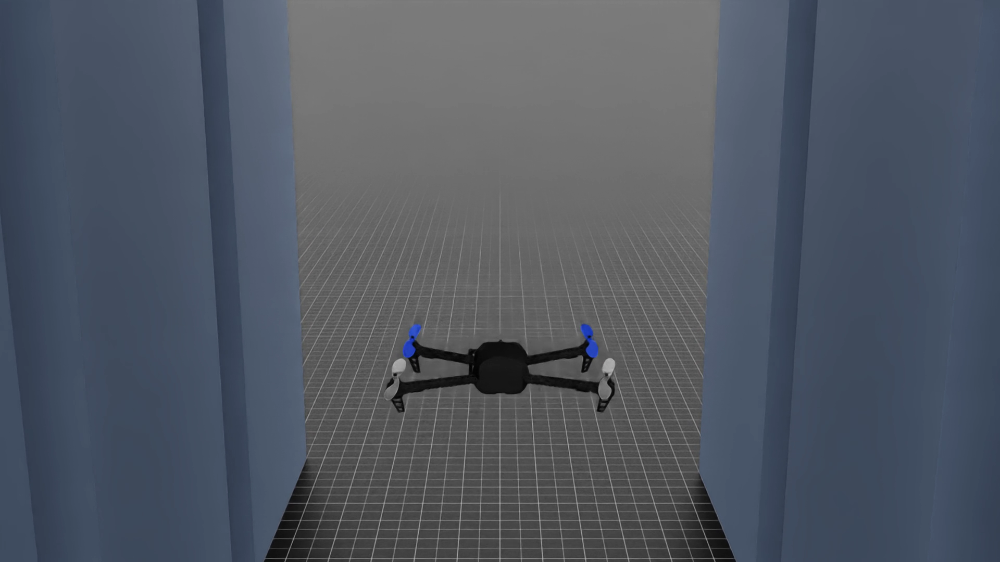
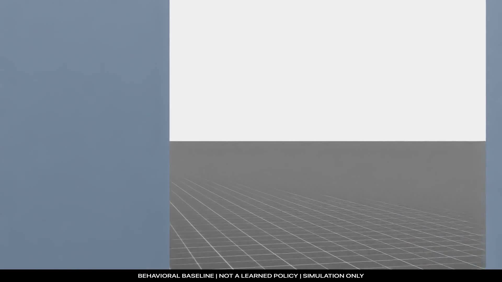
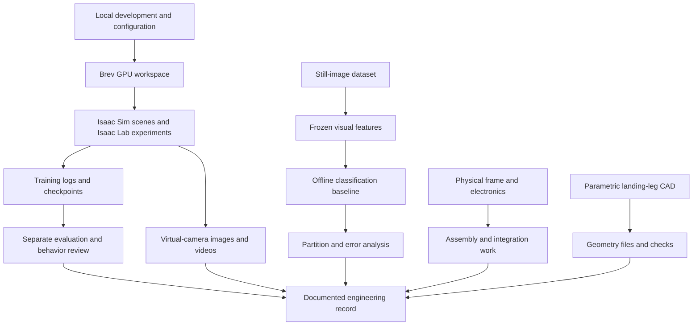
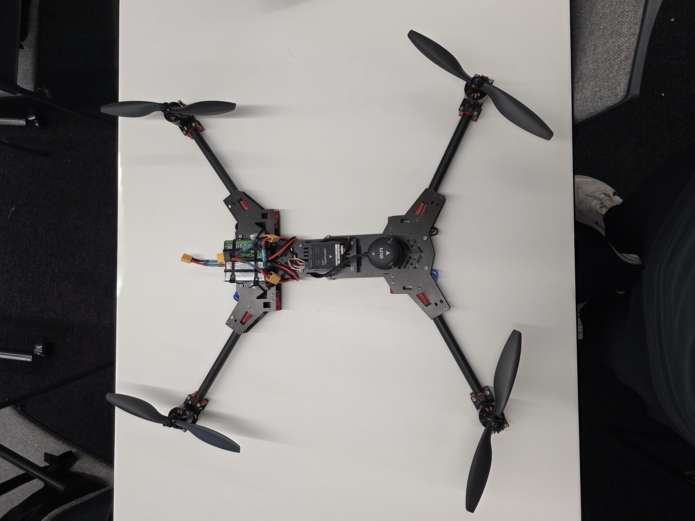

# Annihilation Industries · Warden Core

**A simulation-first robotics project combining experimental learning, computer vision, software instrumentation and hardware development.**

I led Annihilation Industries at the European Defense Tech Hackathon in Hamburg, connecting the simulation and evaluation work with hardware development, team coordination and the project presentation. Vincent developed the separate computer-vision baseline.

This repository explains how the project works and shares selected development footage, build photographs, a runnable observability toolkit and editable landing-leg CAD. The runnable component is the standalone pipeline observability package; the wider simulation, perception and hardware work is documented alongside it.

## Verified engineering highlights

| Completed result | Recorded outcome |
| --- | --- |
| Real Isaac dynamics qualification | 800 cases, 526,800 telemetry records, 400 exact replay pairs, zero failures |
| Parallel GPU scale profile | 15 real-Isaac runs; 2,048 environments selected at 64,094.408 transitions/s |
| Stage 0 shared-policy training | 10 accepted updates and 1,310,720 accepted transitions across 2,048 environments |
| Autonomous corridor demonstration | 15 seconds, 450 frames, 15.485 m travel, zero collisions or safety interventions |
| Engineering contract suite | 409 full tests, 139 focused tests, schema/Ruff/syntax checks passed |

[Read the full verified results](docs/verified-engineering-results.md) · [Explore the system architecture](docs/system-architecture.md)

## Watch the simulation work

| Autonomous trajectory control | Verified simulation montage |
| --- | --- |
| [](media/videos/model-based-autonomous-corridor.mp4?raw=1) | [](media/videos/verified-simulation-montage.mp4?raw=1) |
| **Model-based autonomous corridor flight.** A 15-second, 450-frame direct Isaac Sim render with zero collisions, command saturations or safety interventions in the recorded scenario. | **Isaac Sim development reel.** Camera calibration plus chase and first-person views from the verified mapped-course behavioral baseline. |

[Flight-media provenance and measurements](docs/flight-media.md)

## Additional verified views

| Mapped-course chase camera | Mapped-course first-person camera |
| --- | --- |
| [](media/videos/course-baseline-chase.mp4?raw=1) | [](media/videos/course-baseline-fpv.mp4?raw=1) |

[Physical prototype hover](media/videos/prototype-hover.mp4?raw=1) · [Visual engineering walkthrough](docs/visual-walkthrough.md)

## Explore the engineering in depth

| Walkthrough | What it explains |
| --- | --- |
| [Software internals](docs/software-engineering.md) | Typed events, timestamp ordering, capture assembly, input hashing and assessment behavior. |
| [Computational geometry studies](docs/computational-geometry.md) | The separate PicoGK branch: field/lattice/frame representations and recorded digital checks. |
| [Experiment artifacts](docs/experiment-artifacts.md) | How source revisions, checkpoints, exports and media retain their relationships. |
| [Hardware development](docs/hardware-engineering.md) | Connected-web topology, parametric geometry, STEP/STL integrity and slice-level checks. |
| [Visual record](docs/visual-walkthrough.md) | Build photographs, outdoor hover, simulation cameras and CAD visualizations. |
| [Reproducibility](docs/reproducibility.md) | How source, checkpoints, media and published copies retain their identities. |
| [Verified results](docs/verified-engineering-results.md) | Real-Isaac integration, dynamics, replay, scale profiling, training execution and autonomous corridor results. |
| [System architecture](docs/system-architecture.md) | Cloud, simulator, observation, control, reward and evidence layers. |
| [Flight media](docs/flight-media.md) | Video provenance, exact measurements and the role of each published clip. |

## How the pieces fit together

The project had three development tracks: simulation and learning, offline perception, and physical hardware. They were explored separately before any claim of integration.



The perception and simulation work were separate experiments. The public Python package focuses on measuring pipeline behavior.

## Simulation on NVIDIA Brev and Isaac Sim

Brev supplied the remote GPU workspace. Isaac Sim supplied the scene, robot simulation and virtual cameras, while Isaac Lab supported robot-learning experiments. The local computer was used for development, viewing and preserving the outputs.

Archived runs used Isaac Sim 4.5.0. Early setup records identify Isaac Lab 2.1.0; later Skyline capture records identify 2.1.1. These are historical environment records, not a promise that any mixture of current packages will reproduce the old runs.

The development workflow kept source/configuration identity, logs, checkpoints and media together. Headless experiments and visible scene inspection were separate activities, so a working viewer or an attractive render did not stand in for a successful evaluation.

[Simulation setup and architecture](docs/simulation.md) · [Sources and upstream tools](docs/sources.md)

## How the learning workflow works

In reinforcement learning, a policy produces an action from an observation of the simulated environment. The simulator advances, returns the next observation and a reward, and the learning process updates the policy using the collected experience. Repeating that loop creates training data; it does not automatically produce a useful controller.

Our development records distinguish these steps:

1. **Establish the environment.** Check scene construction and small, repeatable runs before longer experiments.
2. **Record the experiment.** Keep the source revision, runtime identity, configuration and seed with the run.
3. **Train and save state.** Preserve logs and checkpoints so the experiment can be inspected and recovered.
4. **Evaluate separately.** Judge a fixed candidate under recorded conditions instead of treating the training reward as proof of task completion.
5. **Inspect behavior.** Use footage together with the run records to understand what happened.
6. **Preserve the handoff.** Export the files and their checksums before relying on a cloud workspace as the only copy.

The retained archive includes source-linked experiment configurations, logs, closed-source checkpoints, evaluation records and reviewed camera output.

[Training and evaluation documentation](docs/training.md) · [Exact acro-racing reward policy](docs/reward-policy-overview.md) · [Source coverage](docs/vault-source-coverage.md)

The model weights and exported policy artifacts are closed source and are not present in this repository. Commercial, education and academic requests are handled through the [model-access policy](MODEL-ACCESS.md).

## Computer vision and the dataset

Vincent’s offline baseline used ImageNet-pretrained ResNet18 features and a linear classification head trained on CPU. Freezing the visual backbone separated representation extraction from the smaller classification experiment. The retained package includes training records, a checkpoint, a confusion matrix and error analysis across six aircraft/background classes.

The recorded partitions contain 1,331 training, 283 validation and 291 test images. The later preserved collection contains 1,853 images and differs from the training-era inventory. The original notes also identify near-duplicates crossing partition boundaries. Consequently, we do not use the historical score as a claim of real-world recognition performance.

This was still-image classification, not demonstrated recognition during flight. Raw images, embeddings and weights are not distributed here because their complete source and reuse permissions have not been established.

[Computer-vision workflow](docs/perception.md) · [Dataset versions and limitations](docs/dataset.md)

## Physical prototype and CAD

| Open prototype | Folded configuration |
| --- | --- |
|  |  |

The photographs document frame assembly, electronics and the folding configuration. The supplied outdoor recording also shows the physical prototype hovering.

<a href="media/videos/prototype-hover.mp4?raw=1"></a>

*Recorded physical hover. The recording does not document the control mode; it is separate from the simulation-learning experiments.*

A separate LL-11 landing-leg design is included as parametric CadQuery source, STEP and STL files. The geometry remains editable and the exchange files can be inspected without running the generator.


*LL-11 digital design, separate from the photographed frame assembly. Geometry checks and design scope are recorded with the CAD files.*

[Hardware files and reproduction notes](hardware/) · [Detailed CAD engineering](docs/hardware-engineering.md) · [Assembly photographs](media/README.md)

## Try the software

The independently runnable package records event timings, assembles local logs and assesses pipeline measurements. It reports latency, throughput, resource use and missing provenance. A recorded “command” event contains only a timestamp and validity flag, not a vehicle command.

With Python 3.11 or newer, from the repository root:

```sh
cd software
python3 -m venv .venv
. .venv/bin/activate
python -m pip install -e .
warden-record-events --output outputs/events.jsonl < examples/events.jsonl
warden-assemble examples/metadata.json outputs/events.jsonl examples/resources.jsonl \
  --capture-output outputs/capture.json --assessment-output outputs/assessment.json
```

The included example is synthetic. Assembly intentionally returns exit code **2** and `passed: false`; it does not manufacture a hardware pass. Output paths must be new. The package had 44 passing tests at publication, and no vehicle connection is required to try it.

[Full software instructions and tests](software/)

## Repository guide

| Folder | Contents |
| --- | --- |
| [`docs/`](docs/README.md) | Project progress, simulation, training, perception, dataset records and development approach. |
| [`software/`](software/) | Standalone observability package, examples and tests. |
| [`hardware/`](hardware/) | LL-11 source, CAD exchange files and design limits. |
| [`media/`](media/README.md) | Build photos, correctly labelled development videos and media hashes. |
| [`third_party/`](third_party/README.md) | Upstream media credits and licence notices. |
| [`MODEL-ACCESS.md`](MODEL-ACCESS.md) | Closed-source model policy and commercial or academic request route. |

## Licensing

This repository uses a scoped noncommercial licence model:

- project-owned code in `software/` and `tools/` uses the [PolyForm Noncommercial License 1.0.0](LICENSES/PolyForm-Noncommercial-1.0.0.md);
- project-owned documentation, diagrams and specifically identified media use [CC BY-NC-SA 4.0](LICENSES/CC-BY-NC-SA-4.0.md);
- project-owned hardware and CAD use the [Warden Core Hardware Research and Education License 1.0](LICENSES/Warden-Core-Hardware-Research-and-Education-1.0.md); and
- third-party, teammate-owned and rights-unconfirmed material is excluded and remains subject to its own rights and notices.

Noncommercial education, personal experimentation and academic research are permitted within the applicable terms. Commercial use requires a [separate written paid agreement](COMMERCIAL-LICENSING.md). Read the complete [licence map](LICENSE.md) and the folder-specific notice before reusing a file.


## Use the workflow in your own project

We also maintain [Isaac Sim and Brev Operations](https://github.com/Kian-hdr/isaac-sim-brev-operations), a reusable skill for Codex and other AI coding assistants. It explains the workflow and provides project-documentation templates, validation tools and guidance for organizing experiments, preserving outputs and managing GPU work.

Start with its [copy-ready setup prompt](https://github.com/Kian-hdr/isaac-sim-brev-operations/blob/main/SETUP_PROMPT.md). The skill is a workflow/documentation toolkit; install and configure the simulator and cloud environment separately for your project.

## Behind the scenes

My [EDTH Instagram highlight](https://www.instagram.com/stories/highlights/17880192807625231/) shows more of the build process. Instagram may require sign-in.

Kian Tajbakhsh · [GitHub](https://github.com/Kian-hdr) · [Repository scope](docs/scope.md) · [Licence map](LICENSE.md)

## Source basis

The [source records for this chapter](docs/source-records.md#chapter-readme-md) identify the archived versions used in this public explanation.
