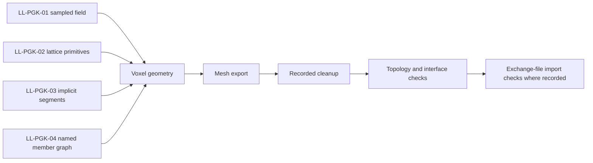

# Computational geometry studies

Alongside the CadQuery landing-leg work, the project explored a separate PicoGK geometry branch. Its four prototypes investigated different representations and validation problems. They are recorded here as computational studies, not alternatives with demonstrated structural or flight performance. LL-11 remains the selected public CadQuery package; LL-PGK-04 is the latest recorded direction within the separate PicoGK branch.

PicoGK is an upstream geometry toolkit from LEAP 71. The project-specific models are not outputs of proprietary Noyron and do not imply endorsement or validation by LEAP 71. Existing notices identify Apache 2.0 terms for the PicoGK dependency; that does not automatically license every project input or generated package.

## From signed-distance fields to explicit load graphs

| Study | Representation | Recorded digital result | Evidence scope |
| --- | --- | --- | --- |
| LL-PGK-01 | A bounded signed-distance field sampled at 0.35 mm | One connected watertight mesh with 272,652 triangles; sampled insert and shaft clearances | No slicing, calibrated material model or load rating |
| LL-PGK-02 XENOWEB | Native lattice primitives with curved arches, branches and helical ribs | One retained watertight component with 362,308 triangles | An organic geometry concept, not a solver-informed structure or qualified print candidate |
| LL-PGK-03 EXOSHELL-SF | Thirteen curve families sampled into 183 planar implicit segments | Repeated generation hash, voxel convergence and read-only four-instance 3MF imports | Superseded by LL-PGK-04; analytic growth checks did not establish support-free slicing |
| LL-PGK-04 LOADFRAME | Nine named frame members connecting the provisional mounting interface to the ground rail | One connected watertight mesh with 1,152,806 triangles; repeatability, convergence and read-only import records | No slicing or physical qualification; triangle-angle audit still identifies steep voxel stair facets |

These results are preserved historical reports. They have not been regenerated as part of the public documentation review.

This explanatory map groups the representations studied; the table gives each study’s actual recorded check scope.

## Mesh validation was part of the work

The studies expose the difference between generating a shape and delivering an inspectable mesh. LL-PGK-01's raw export contained 84 zero-area facets. Its export wrapper removed those degenerate facets and recomputed finite normals before independent topology checks. LL-PGK-02 similarly removed degenerate facets and tiny artifact islands, retaining the principal component; the cleanup was recorded rather than hidden.

LL-PGK-04's report describes 13 bounded boundary closures after degenerate-facet filtering. The repair added 13 triangles with negligible recorded volume change. Its subsequent repeat generation produced the same hash, and its voxel-resolution comparison retained a consistent enclosed volume. Repeatability and convergence support confidence in the digital artifact, but neither establishes that the shape carries a particular load.

## Print-oriented geometry is not a printability result

The later studies placed their principal members in the layer plane and used pointed functional bores to control analytic overhang angles. Their geometry-only 3MF files contained no print instructions or material presets. Read-only imports into Bambu Studio and OrcaSlicer verified that those files could be read as four manifold instances; the importers were not asked to slice them.

The evidence deliberately retains an unresolved discrepancy. Although analytic layer-growth checks passed, triangle-normal audits found steep stair facets around the voxelized pointed bores: 66.85 mm² for LL-PGK-03 and 72.09 mm² for LL-PGK-04. Consequently, neither should be described as support-free slice verified. The available import and analytic checks do not establish actual wall starts, bridge behavior or thin-feature survival.

## What these studies establish

The branch demonstrates editable geometry construction, export cleanup, topology checks, provisional interface sampling and representation comparisons. Reported volume reductions are comparisons between digital solids, not evidence of lower finished mass, better efficiency or equal strength. The studies did not close a solver-driven design loop or establish anisotropic material behavior, buckling resistance, insert retention, fatigue, impact capacity or installed fit. Source geometry and third-party reference inputs require separate publication review before any broader package release.

## Source basis

This public explanation is grounded in the dated project records identified in the [source records for this chapter](source-records.md#chapter-docs-computational-geometry-md). The catalogue distinguishes complete notices from adapted explanations and preserves separate document versions.
