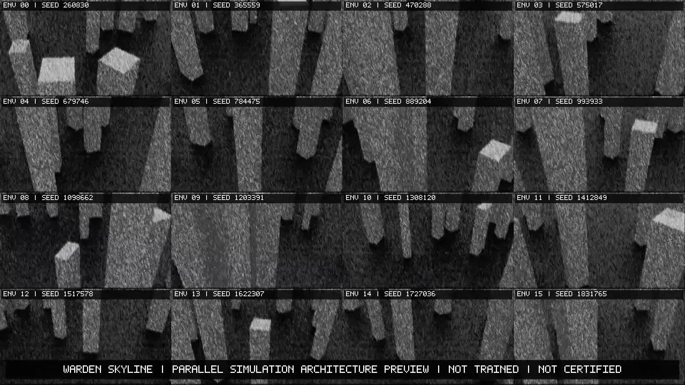
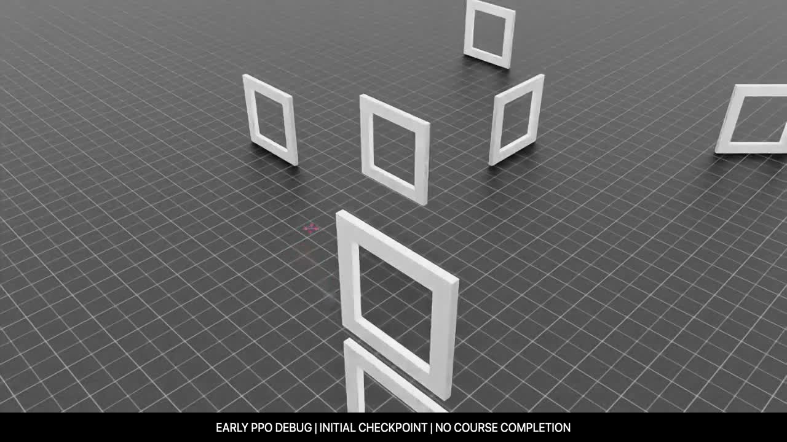

# Flight and simulation media

The media library shows several completed parts of the Warden Core engineering workflow: autonomous trajectory control, mapped-course simulation, virtual-camera capture, parallel-scene visualization and physical prototype development.

## Model-based autonomous corridor flight

The 15-second chase-camera demonstration records a physically simulated Iris surrogate flying through a fictional skyscraper corridor under a model-based autonomous trajectory controller.

| Property | Verified value |
| --- | --- |
| Video | H.264, 1,920 × 1,080, 30 fps, 450 frames |
| Simulated travel | 15.485 m maximum displacement |
| Maximum speed | 1.735 m/s |
| Runtime result | Zero collisions, flight-volume violations, command saturations and safety interventions |
| Media QA | Full decode, 450 unique decoded frame hashes, visual/motion/provenance review passed |
| Source revision | `d48c92668000fe1e435de47a093001d008ea0d10` |
| Published SHA-256 | `de2629261c7be02d4c2c1ae0d5154b5c0f318e4765820539269430918fa319ee` |

This is a direct render from the verified model-based controller stage. It demonstrates the simulator, dynamics, bounded command path and autonomous trajectory execution in the recorded corridor scenario.

## Verified simulation montage

The 34.5-second montage combines three technically and visually reviewed Isaac Sim camera outputs with title cards:

1. exterior camera calibration around the Iris surrogate;
2. a chase-camera view of the mapped-course behavioral baseline; and
3. the corresponding first-person camera view.

The montage is H.264, 1,920 × 1,080, 30 fps and contains only source clips that passed full decode and representative-frame review. Published SHA-256: `b2c79e1a3f51c7be223c47b45a7012ec6a9eff6dce65536690aa65156baa0a83`.

## Parallel simulation view

Sixteen seeded scene views show the parallel simulation architecture used to scale environment execution. The 4 × 4 presentation makes the environment variation and shared workflow visible in one frame.

## Mapped-course cameras

| Chase camera | First-person camera |
| --- | --- |
|  |  |

These synchronized ten-second views record the verified PX4-style behavioral baseline in the mapped course. The source run completed its applicable runtime and scene checks with zero safety interventions, command saturations, collisions or flight-volume violations.

## Early PPO playback

The two-second Isaac Drone Racer clip preserves an early checkpoint playback from the learning workflow. It is included as a visual record of the experiment environment and checkpoint replay path.

## Physical prototype

The one-minute outdoor recording shows the assembled physical prototype hovering. The build gallery documents its folding frame, electronics and wiring.

## Provenance and upstream assets

Simulation footage was rendered in NVIDIA Isaac Sim. The Iris surrogate and Isaac Drone Racer environment remain subject to the upstream notices in [`third_party/`](../third_party/README.md). The project media licence covers the project-created scene composition, camera work, labels and presentation to the extent those rights are held by the project contributor.
