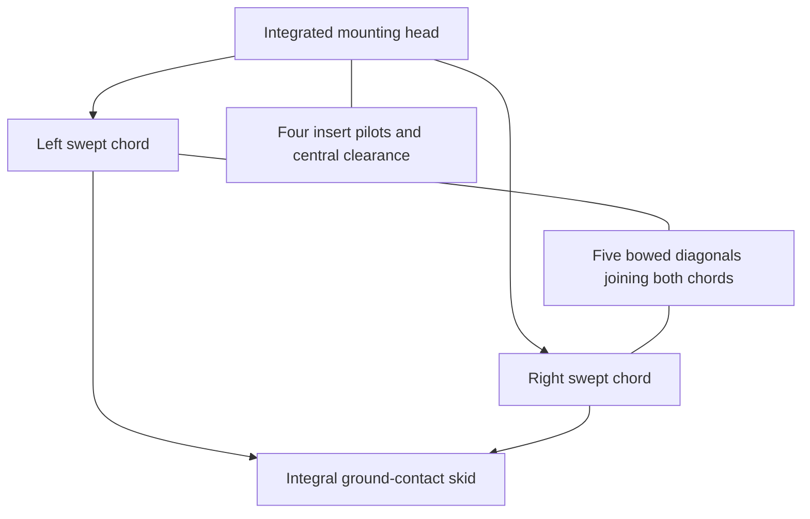
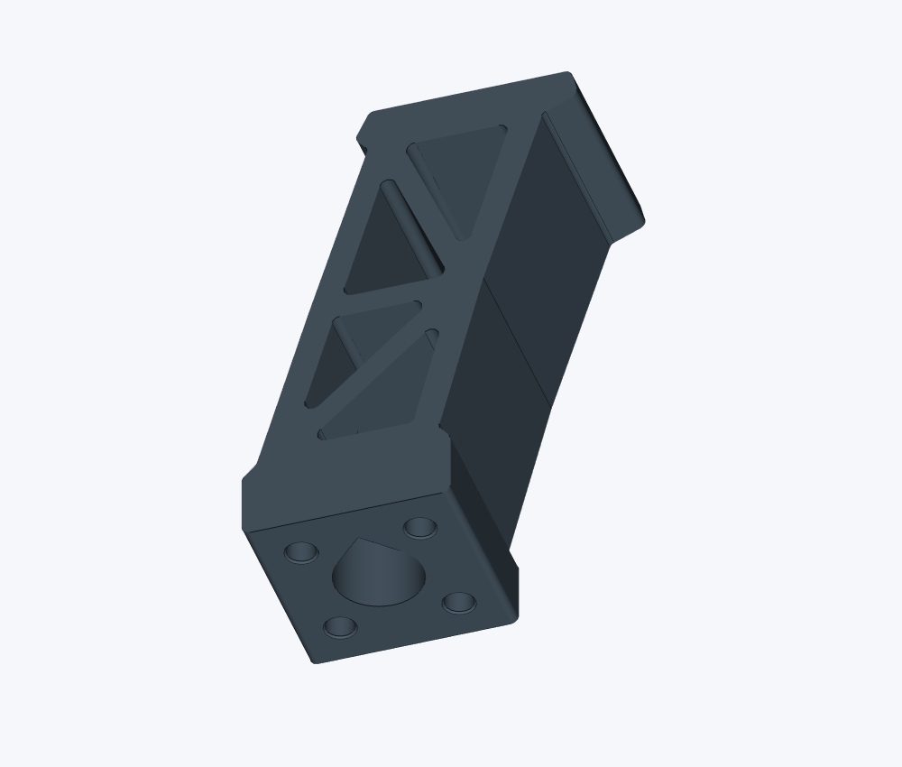
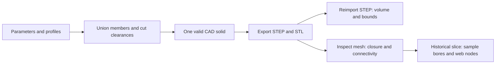
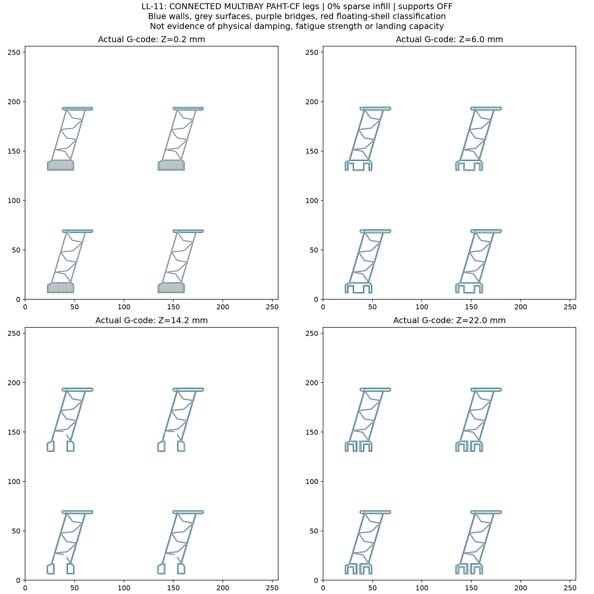
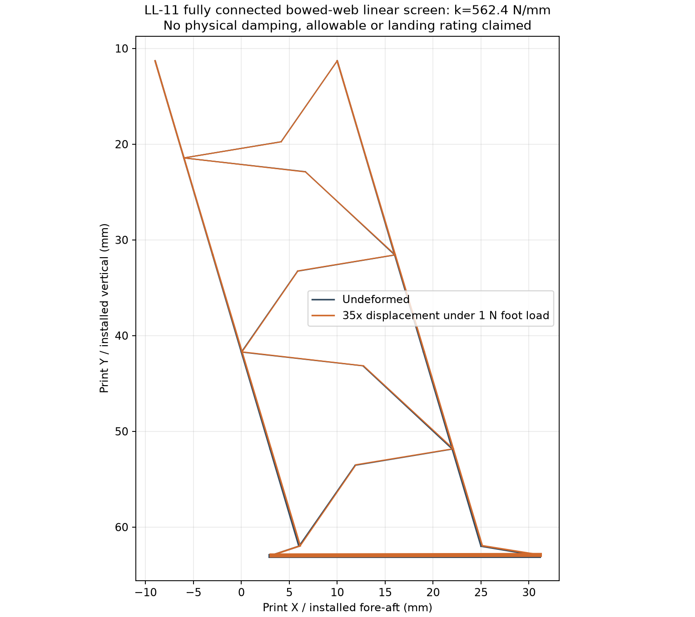

# LL-11: geometry, iteration and digital evidence

LL-11 is a one-piece landing-leg prototype with an integrated mounting head, a connected open web and a ground-contact skid. Its engineering interest lies in the relationship between topology, geometry and verification: a visually plausible lattice is not enough. The source defines connected members, the exported solid must preserve those connections, and a slicing check must still find material where the design expects it.

## A connected five-panel structure

Two swept outer chords run from the mounting head toward the skid. Six stations on each chord define five web panels. Each panel contains a two-segment diagonal whose ends join the opposite chords; the intermediate knee gives the diagonal a bowed shape. The topology therefore has five connected braces and ten brace endpoints. These counts describe the design, not ten independent physical load paths with qualified strength.

The diagram shows component relationships rather than calculated force distribution. The exact CAD envelope is 47.3 × 65.1 × 28.0 mm, with a solid volume of 18,609.05 mm³. That volume is geometric material volume, not the mass of a sliced or printed part. The nominal height is 65 mm; rounded geometry makes the bounding-box height 65.1 mm.

## How the source expresses the shape

The CadQuery implementation starts with planar profiles and extrudes them across the 28 mm width. A member is built from a rectangular segment with rounded ends. Chains of these members form the chords, while each bowed brace uses a midpoint displaced normal to the line between its endpoints. The current bow parameter is 4.0 mm. The swept chords are 1.6 mm wide and the braces 1.2 mm wide in the profile plane.

The mounting carrier retains its full section through 9.0 mm and tapers into the web by 11.5 mm. Four provisional insert pilots are 4.0 mm in diameter and 7.0 mm deep. Those values remain design inputs: they do not establish compatibility with an unspecified insert, filament or installed frame. Boolean cuts form the pilots and a central clearance after the body members are united.

This structure makes the important design inputs inspectable in code. It does not make every arbitrary parameter substitution valid. Changing chord width, station positions or clearance geometry can disconnect a member, close a hole or create interference. Each modified revision needs its own geometry checks.

## What changed during iteration

| Earlier LL-07 study | LL-11 connected multibay design |
| --- | --- |
|  |  |

The earlier study is shown for design evolution; the public CAD package contains LL-11.

The recorded direction returned to LL-07's swept open-web arrangement and then increased the panel count. LL-10 introduced five gap-ended braces intended to engage progressively. It was rejected because the diagonals stopped short of the opposite chord, contrary to the requested connected web. LL-11 joins both ends of each diagonal and retains a bowed knee to avoid simply replacing every brace with a straight axial member.

The development record also captures a useful failure. An early LL-11 upper knee crossed the assumed central clearance at a sampled layer. The toolpath check found the expected connection point 6.166 mm from the nearest material path and failed. The first panel's bow was reversed away from that clearance, followed by regenerated CAD, slices and checks. This is evidence of detecting and correcting a specific digital inconsistency; it is not physical testing.

## Digital validation has several layers

The original LL-11 CAD report records one valid solid, a successful STEP round trip and one connected watertight mesh region. The STEP volume difference was approximately 1.47 × 10⁻⁸ mm³, below its recorded tolerance. The retained STL contains 5,862 triangles. The public-package review independently checked that every mesh edge belongs to two triangles and confirmed that the delivered artifacts are unchanged copies. These checks address representation integrity, not material behavior.

The original offline slicing record sampled 65 insert-bore locations, five central-passage locations and 44 web nodes across four legs. The recorded checks passed after the geometry correction. The selected slice used four walls and zero sparse infill; walls, skins, bridges and local filling still remain. A toolpath image shows this distinction directly. Vendor presets and executable print jobs are not needed to explain those historical checks and are excluded from the curated package.

*Recorded slice geometry at several layer heights.*

## Mechanics screen

A saved two-dimensional Euler–Bernoulli frame calculation predicts 562.44 N/mm vertical stiffness using a 3,860 MPa reference modulus from a dry material specimen. Its equilibrium, energy and subdivision checks support the consistency of that numerical screen. They do not turn the reference modulus into a measured property of this printed geometry. The model omits calibrated anisotropy, nonlinear deformation, knee buckling, material hysteresis, insert behavior and fatigue; it therefore establishes neither damping nor allowable landing load.

*Numerical deformation visualization; the magnification and no-rating labels are retained.*

The public generator separates leg geometry from the original reference assembly. Its geometry functions match the original source, but native regeneration was not reverified during publication preparation because the available local CAD environment stalled while loading dependencies. The supplied exports remain inspectable without that environment. Physical qualification is outside the evidence represented by these digital checks.
