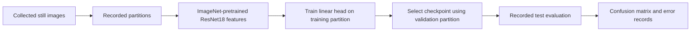

# Computer-vision baseline

Vincent developed the team’s separate offline computer-vision experiment. It used frozen ImageNet-pretrained ResNet18 features and a linear classification head trained on CPU. This provided a compact baseline that could be inspected through its saved inputs, training log and error analysis.

## What the work produced

The collected-stills experiment covered six aircraft/background classes. Its retained package includes a checkpoint, extracted features, training log, confusion matrix and error records. The saved run records seed 1337 and validation-based selection of epoch 33.

The workflow separated feature extraction from training the classification head. Training, validation and test partitions were recorded, and class-level errors were retained alongside the aggregate results. This produced an inspectable experiment rather than a few hand-picked examples.

## How the experiment was structured

A frozen feature extractor keeps its pretrained representation fixed while the smaller classification head is fitted to the project’s image classes. This separates the representation source from the team’s own training contribution. The saved experiment used CPU training for the head and retained the feature arrays, training log and selected checkpoint.

The partition record matters as much as the model file. Training data fits the head; validation data informs checkpoint selection; the test partition is used for the recorded evaluation. The source notes identify overlap from near-duplicates across those partitions, which affects how the historical score should be interpreted.

| Retained item | Engineering purpose |
| --- | --- |
| Image/partition records | Identify which examples belonged to each recorded split. |
| Extracted features | Preserve the representation used by the head-training experiment. |
| Training log | Follow the recorded optimization and checkpoint-selection history. |
| Checkpoint | Preserve the selected model state. |
| Confusion matrix | Examine how errors were distributed across classes. |
| Error records | Inspect examples behind aggregate counts. |

## Dataset and evaluation scope

The [dataset record](dataset.md) describes the collected set and recorded partitions. The experiment was still-image classification, not object detection or recognition during flight. Its records identify near-duplicate images crossing partition boundaries, so its historical test score should not be treated as an independent measure of real-world generalization. We do not use that score as a headline capability claim.

The perception experiment was not integrated into a demonstrated autonomous flight system. Awareness and avoidance remain separate from any inference about intent; no targeting or engagement function is published here.
