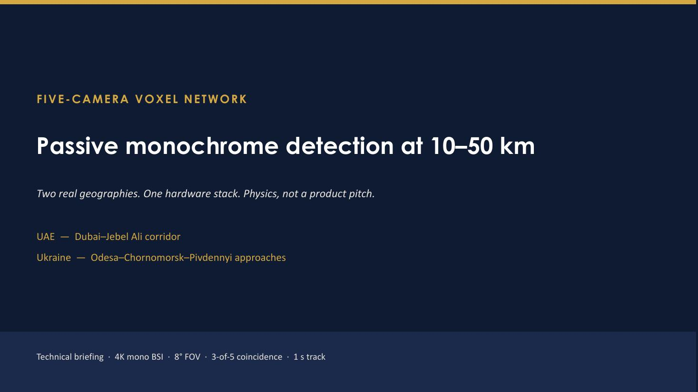

# Warden Corps camera study

**Contributor:** Leon

**Project relationship:** Related Annihilation Industries sensing study, separate from Warden Core autonomy

## Presentation summary

The study asks how several fixed monochrome cameras can turn faint image motion into a shared spatial estimate. It models five 4K sensors with an 8° horizontal field of view and requires coincidence across at least three views.

## 1. Convergent camera geometry

Each camera contributes a bearing into a common volume. The geometry study compares two coastal arrangements and records the baseline, look direction and field-of-view overlap used by the model.

## 2. Image scale with range

The ground-sample-distance model calculates how one pixel’s spatial footprint grows with slant range. This determines when an object remains resolved and when the model treats its reflected flux as unresolved.

## 3. Multi-view probability

The probability study combines sensor noise, atmospheric transmission, illumination and 3-of-5 coincidence. The panels show how those assumptions change the modeled network response across object classes and ranges.

## 4. Sparse voxel path tracing

Motion pixels cast rays into a shared voxel volume. Sparse traversal follows those rays, and their high-intensity crossing identifies the candidate 3D point. Repeating the estimate over time forms a worldline.

## 5. Contribution to the project story

Leon’s presentation expands the project beyond a single camera. Vincent’s classifier asks what appears in one image, while the multi-camera study asks where a consistent object lies in 3D and how its path changes over time. The two remain separate technical studies with distinct evidence.

[Detailed subsystem explanation](../subsystems/multicamera-sensing.md) · [Team contributors](../../licensing/contributors-and-rights.md)
