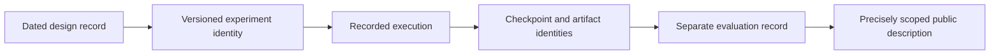

# Reward and policy documentation

The project archive contains dated specifications for the learning experiments, including an initial training specification and a later reward-and-policy design record. Writing and versioning those specifications was part of the engineering work. Their existence is distinct from a completed training run or a demonstrated controller.

## Terms used in the records

A **policy** is the model used to produce an output from an observation. A **reward** is feedback used during learning. An **evaluation** is a separate assessment of a fixed candidate under recorded conditions. A **checkpoint** preserves model state at a point in an experiment.

These records serve different purposes. A training score describes feedback collected by the experiment. It does not, by itself, establish that the intended task was completed. A checkpoint identifies a saved state; its accompanying evaluation and behavior records determine what can be said about that state.

## What the design record documents

The retained specification separates the definition of an experiment from the record of its execution. Its sections cover the intended interfaces, learning objectives, curriculum organization, evaluation, artifact handling and implementation checkpoints. Later dated execution entries identify which parts had accompanying implementation or runtime evidence.

This public overview documents that structure. It does not reproduce operational reward formulas, flight-control parameters, implementation instructions or pursuit/interception training specifications.

## Reading the public material

- [Training workflow](training.md) explains how the project retained configurations, logs and checkpoints.
- [Simulation workflow](simulation.md) describes the Brev and Isaac Sim environment at a project level.
- [Reproducibility](reproducibility.md) explains artifact identity and copy verification.
- [Media gallery](../media/README.md) distinguishes initial checkpoint playback, behavioral baselines, scripted visualization and physical-prototype footage.

The public repository is a scoped engineering record. The original Vault specifications remain in the private project archive; their omission does not imply an undisclosed working autopilot.
