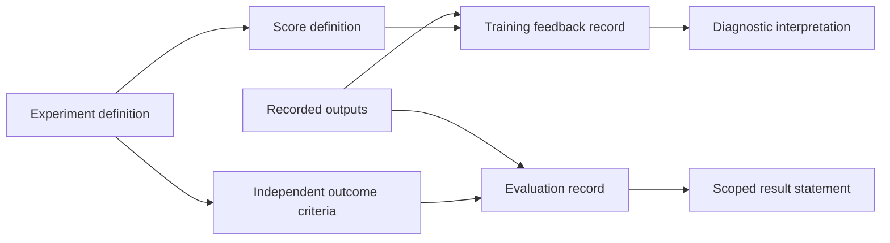

# Acro-racing reward and policy specification

The 2026-08-30 Warden acro-racing design record contains a complete mathematical reward specification for the simulation profile. It separates the score used during learning from the conditions used to judge an outcome. This page reproduces that reward policy and its invariants while leaving pursuit/interception material and vehicle-operation instructions outside the public edition.



The diagram is a new explanation of the separation documented in the source records.

## Start with an outcome outside the score

A learner can increase its score without doing what the experiment was intended to measure. The first design task is therefore to define a valid outcome independently: which conditions must hold, which events invalidate the attempt, and which observations can establish the result. Evaluation then checks that definition directly. A high return is useful diagnostic information, but it cannot replace the outcome record.

The early specification separated baseline execution, learning and frozen playback. That separation matters because each can expose a different defect. A baseline can reveal a problem with the environment or recorded conditions before a learning algorithm is blamed. A training run can create a checkpoint without producing a successful evaluation. A playback can demonstrate what a particular saved state did without establishing generalization.

## Give every score component a purpose

The records called for named components with documented meaning, units, normalization and bounds. This makes an unexpected change in the total score traceable. If several components change at once, it becomes harder to identify which design choice caused a new behavior.

The initial plan favored a small set of components, adding complexity only when an observed failure supplied a reason. The later design introduced an explicit bound on the influence of intermediate shaping, so accumulating convenient intermediate events cannot outweigh an invalid final outcome.

## Exact recorded reward function

Let

- `dt = 0.02 s` be the policy interval;
- `T_max = 30 s` be the episode limit;
- `L` be the course length;
- `s_t ∈ [0, L]` be the ordered course coordinate;
- `a_t` be the normalized applied action;
- `d_t` be the exact minimum vehicle-surface clearance;
- `m = 1.5 m` be the clearance risk margin;
- `v_t` be the visible fraction of the next gate;
- `c_t` be perception confidence; and
- `θ_t` be the angle between the camera optical axis and the direction to the next-gate centre.

The course coordinate is defined on the active interval of a precomputed collision-free racing tube. Advancing the gate index requires a swept crossing of the correct directed gate plane, through its aperture, with the vehicle collision hull accounted for.

The raw dense shaping signal is

```math
\begin{aligned}
z_t ={}& 3.0\,\operatorname{clip}\!\left(\frac{s_t-s_{t-1}}{L},-0.02,0.02\right)-0.002 \\
&+0.10\,\mathbb{1}[\text{correct next-gate crossing}] \\
&-0.05\,\operatorname{clip}\!\left(\frac{\max(0,s_{t-1}-s_t)}{0.02L},0,1\right) \\
&+0.0005\,v_t c_t\max(0,\cos\theta_t) \\
&-0.005\,B(d_t) \\
&-0.001\,\frac{\lVert a_t-a_{t-1}\rVert_2^2}{4} \\
&-0.002\,S_t \\
&+0.001\,R_t .
\end{aligned}
```

The clearance barrier is

```math
B(d)=\operatorname{clip}\!\left(\left(\frac{m-d}{m}\right)^2,0,1\right).
```

`S_t` is the fraction of the previous `0.30 s` during which any motor, rate, or moment channel was saturated, applied after the first `0.10 s` of continuous saturation. `R_t ∈ [0,1]` is a curriculum-only recovery indicator, active in recovery stages when attitude error and body-rate magnitude decrease while clearance remains safe or improves.

| Term | Coefficient | Purpose |
| --- | ---: | --- |
| Ordered tube progress | `3.0` | Reward bounded forward progress on the active course interval. |
| Elapsed step | `-0.002` | Prefer shorter valid completion. |
| Correct next-gate crossing | `+0.10` | One-shot credit for the ordered directed event. |
| Reverse progress | `-0.05` | Penalize bounded backward motion. |
| Visibility/confidence/alignment | `+0.0005` | Small perception-compatible shaping term. |
| Clearance barrier | `-0.005` | Increase cost inside the `1.5 m` risk margin. |
| Applied-action change | `-0.001` | Penalize squared normalized action change. |
| Sustained saturation | `-0.002` | Penalize prolonged saturation after its grace window. |
| Curriculum recovery | `+0.001` | Reward improving recovery state only in recovery stages. |

Every term and the combined `z_t` are logged before clipping.

## Bounded shaping ledger

Instead of allowing dense shaping to accumulate without limit, the specification uses an episodic ledger:

```math
H_0=0,\qquad
H_t=\operatorname{clip}(H_{t-1}+z_t,-1,1),\qquad
h_t=H_t-H_{t-1}.
```

Therefore

```math
\sum_t h_t = H_T \in [-1,1].
```

The recorded calibration condition requires ledger clipping on fewer than `0.1%` of evaluation steps. More frequent clipping means the coefficients or normalization need recalibration.

## Terminal reward and return-dominance proof

The terminal terms are

```math
F=5+2\,\operatorname{clip}\!\left(1-\frac{T_{\mathrm{finish}}}{T_{\max}},0,1\right)
```

for valid ordered completion, and

```math
X=-5
```

for any invalid terminal. The per-step reward is

```math
r_t=h_t+\mathbb{1}[\text{valid finish}]F+\mathbb{1}[\text{invalid terminal}]X,
\qquad \gamma=1.0.
```

Because the shaping return lies in `[-1,1]`, even the slowest valid completion has return at least

```math
-1+5=4,
```

while any invalid run has return at most

```math
1-5=-4.
```

This is the specification's terminal-dominance invariant: an early invalid termination cannot outscore a valid completion.

## Event handling

| Event | Reward treatment | Episode result |
| --- | --- | --- |
| Correct next gate, correct direction, hull inside aperture | Gate term; increment gate index once | Continue, or finish after the final gate. |
| Reverse progress | Bounded reverse-progress term | Continue while recovery remains possible. |
| Wrong gate order or backward gate crossing | `X = -5` | Invalid terminal. |
| Recoverable missed gate | Reverse-progress and time costs continue | Continue inside the recovery region. |
| Unrecoverable miss, contact, flight-volume exit, invalid numeric/actuator state, or timeout | `X = -5` | Invalid terminal. |
| Valid final crossing | `F` | Successful terminal. |

The gate-frame collision remains active during aperture passage. Contact categories are retained separately in evidence even though they share the same terminal value.

## Recorded coefficient sweeps

The design record permits initial sweeps over the following ranges while fixing the ledger and terminal invariants:

| Component | Sweep range |
| --- | ---: |
| Progress | `[2, 4]` |
| Time cost | `[-0.001, -0.004]` |
| Gate crossing | `[0.05, 0.20]` |
| Camera alignment | `[0.0002, 0.001]` |
| Clearance barrier | `[-0.002, -0.010]` |
| Action change | `[-0.0005, -0.003]` |
| Saturation | `[-0.001, -0.006]` |
| Recovery | `[0, 0.002]` |

The terminal values `F`, `X` and the ledger bounds remain fixed during those sweeps.

## Emergent maneuver policy

The specification does not pay directly for rolls, loops, Split-S transitions, dives, climbs, high speed, high tilt, or angular rate. Maneuvers are intended to emerge only when they reduce valid completion time for the presented course geometry. Progress remains tied to the active ordered interval, gate rewards are one-shot, hovering pays the time cost, and the bounded alignment term cannot dominate progress or terminal outcome.

## Make changes interpretable

The design review considered whether an improved score could diverge from a valid outcome. Its documentation separated the observed event, the score component affected, the outcome record and the reason an attempt ended. This makes a change in bookkeeping distinguishable from a change in the behavior being measured.

Failed attempts remain part of the private evidence. Changing the definition of success after inspecting a candidate changes the experiment, so dated definitions and execution records were retained separately.

## Keep information and selection boundaries explicit

The later specification distinguished information available to a policy from privileged simulator information used by a critic or an evidence recorder. Giving evaluation-only truth to the policy would change what the experiment demonstrates. The same concern applies to normalization state, reset state and data partitions: their sources and permitted uses need to be recorded.

Training, validation and unseen evaluation have different jobs. Training fits the model. Validation informs development and candidate selection. A final evaluation checks a fixed candidate under recorded conditions. Changing model parameters or normalization during that final check would make the candidate’s identity ambiguous.

## Preserve the chain from definition to evidence

The records linked experiment identity to source revision, configuration, seed, checkpoint and evaluation artifacts. They also distinguished the latest saved checkpoint from a candidate selected through evaluation. A saved state can be recoverable while still lacking the evidence required for promotion.

This distinction mattered in the retained project history: checkpoint artifacts and host-side implementation existed, while a later frozen evaluation did not produce a completed promotion record. The public videos therefore keep their own labels: initial checkpoint playback, a behavioral baseline, or scripted visualization. Their appearance cannot fill a missing evaluation result.

The transferable contribution is the discipline of making each claim traceable: define the outcome, explain the score, test failure paths, freeze the candidate, retain the evidence and state what the result actually supports.

This is a newly written public adaptation of the archived design records. It reproduces the recorded reward equations and coefficients above, but does not reproduce aircraft-control interfaces, course-generation implementation, pursuit/interception logic, or vehicle-operation instructions. [Source coverage](vault-source-coverage.md) identifies the publication forms.

## Source basis

This public explanation is grounded in the dated project records identified in the [source records for this chapter](source-records.md#chapter-docs-reward-policy-overview-md). The catalogue distinguishes complete notices from adapted explanations and preserves separate document versions.
