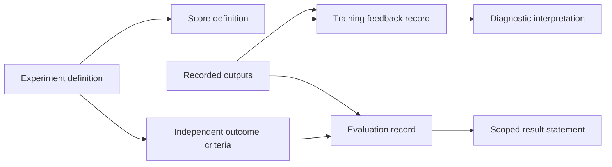

# Reward design and experiment records

The Warden design records treated reward design as an experimental contract. They separated the score used during learning from the conditions used to judge an outcome. The principles below explain that methodology. They do not describe a completed trained controller or reproduce the private control specification.

The diagram is a new explanation of the separation documented in the source records.

## Start with an outcome outside the score

A learner can increase its score without doing what the experiment was intended to measure. The first design task is therefore to define a valid outcome independently: which conditions must hold, which events invalidate the attempt, and which observations can establish the result. Evaluation then checks that definition directly. A high return is useful diagnostic information, but it cannot replace the outcome record.

The early specification separated baseline execution, learning and frozen playback. That separation matters because each can expose a different defect. A baseline can reveal a problem with the environment or recorded conditions before a learning algorithm is blamed. A training run can create a checkpoint without producing a successful evaluation. A playback can demonstrate what a particular saved state did without establishing generalization.

## Give every score component a purpose

The records called for named components with documented meaning, units, normalization and bounds. This makes an unexpected change in the total score traceable. If several components change at once, it becomes harder to identify which design choice caused a new behavior.

The initial plan favored a small set of components, adding complexity only when an observed failure supplied a reason. The later design introduced an explicit bound on the influence of intermediate shaping. The general principle is that accumulating convenient intermediate events should not outweigh an invalid final outcome. The public explanation stops at that principle; application-specific formulas and control parameters are not included.

## Make changes interpretable

The design review considered whether an improved score could diverge from a valid outcome. Its documentation separated the observed event, the score component affected, the outcome record and the reason an attempt ended. This makes a change in bookkeeping distinguishable from a change in the behavior being measured.

Failed attempts remain part of the private evidence. Changing the definition of success after inspecting a candidate changes the experiment, so dated definitions and execution records were retained separately.

## Keep information and selection boundaries explicit

The later specification distinguished information available to a policy from privileged simulator information used by a critic or an evidence recorder. Giving evaluation-only truth to the policy would change what the experiment demonstrates. The same concern applies to normalization state, reset state and data partitions: their sources and permitted uses need to be recorded.

Training, validation and unseen evaluation have different jobs. Training fits the model. Validation informs development and candidate selection. A final evaluation checks a fixed candidate under recorded conditions. Changing model parameters or normalization during that final check would make the candidate’s identity ambiguous.

## Preserve the chain from definition to evidence

The records linked experiment identity to source revision, configuration, seed, checkpoint and evaluation artifacts. They also distinguished the latest saved checkpoint from a candidate selected through evaluation. A saved state can be recoverable while still lacking the evidence required for promotion.

This distinction mattered in the retained project history: checkpoint artifacts and host-side implementation existed, while a later frozen evaluation did not produce a completed promotion record. The public videos therefore keep their own labels: initial checkpoint playback, a behavioral baseline, or scripted visualization. Their appearance cannot fill a missing evaluation result.

The transferable contribution is the discipline of making each claim traceable: define the outcome, explain the score, test failure paths, freeze the candidate, retain the evidence and state what the result actually supports.

This is a newly written public adaptation of the archived design records. It does not reproduce their operational formulas, coefficients, aircraft-control interfaces or pursuit/interception implementation instructions. [Source coverage](vault-source-coverage.md) identifies the publication forms.

## Source basis

This public explanation is grounded in the dated project records identified in the [source records for this chapter](source-records.md#chapter-docs-reward-policy-overview-md). The catalogue distinguishes complete notices from adapted explanations and preserves separate document versions.
