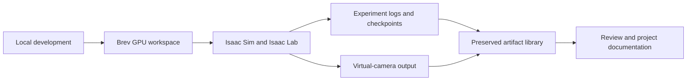

# NVIDIA Brev and Isaac Sim

[Complete Isaac-agent subsystem guide](../subsystems/isaac-agent.md) · [Policy specifications](../policies/README.md) · [Verified run identities](../results/run-identities.md)

We used NVIDIA Brev to access remote GPU infrastructure and NVIDIA Isaac Sim with Isaac Lab for the simulation work. Keeping compute remote let the local machine serve as the development and viewing workstation while experiment outputs were preserved separately.

## The stack

| Layer | Role in the project |
| --- | --- |
| NVIDIA Brev | Remote GPU workspace and access to the development environment. |
| Isaac Sim | Scene construction, simulation runtime and virtual-camera rendering. |
| Isaac Lab | Robot-learning environment and reinforcement-learning workflow. |
| Python project code | Experiment definitions, data contracts, logging and output packaging. |
| Local artifact library | Preserved source, configurations, checkpoints, logs and media after cloud work. |

Archived runs used Isaac Sim 4.5.0. Earlier setup records identify Isaac Lab v2.1.0, while later Skyline capture records identify v2.1.1. These are historical project versions, not a recommendation to combine them with today’s latest packages. Fresh installation should follow the compatible versions documented by NVIDIA.

## How we organized runs

Each experiment had an identifier and a recorded source/configuration context. Environment setup and small integration checks came before longer experiments. Headless execution and visible inspection served different purposes: headless work produced experiment outputs, while the viewer helped inspect scene and camera behavior.

The project retained configurations, checkpoints and logs together. This made it possible to distinguish an experiment that created a checkpoint from one that completed its evaluation, and to continue investigating an interrupted run without relying on an edited video.

## From simulation to presentation

The camera workflow produced frame sequences and encoded video. The public [autonomous corridor demonstration](../media/provenance.md#model-based-autonomous-corridor-flight) connects a source revision, physically simulated vehicle, model-based trajectory controller, runtime measurements, 450 source frames and independent technical/visual review. The [verified simulation montage](../media/provenance.md#verified-simulation-montage) combines exterior, chase and first-person camera work with explicit title cards.

The simulator SDK, third-party robot assets and cloud-machine configuration are not distributed in this repository. NVIDIA products are tools used by the project; their use does not imply NVIDIA endorsement or partnership.

Official references: [Brev overview](https://docs.nvidia.com/brev/getting-started/overview), [Isaac Sim 4.5 documentation](https://docs.isaacsim.omniverse.nvidia.com/4.5.0/index.html), and [Isaac Lab](https://isaac-sim.github.io/IsaacLab/).

For a reusable version of this workflow, see our [Isaac Sim and Brev Operations skill](https://github.com/Kian-hdr/isaac-sim-brev-operations) and its [setup prompt](https://github.com/Kian-hdr/isaac-sim-brev-operations/blob/main/SETUP_PROMPT.md).

## Simulator surrogate and physical airframe

The recorded vehicle decision selected a pinned Pegasus Simulator Iris asset for the established Isaac runtime. It provided an identifiable simulation model while the physical airframe was being developed. The original model identity and asset hash were kept with the simulator configuration, and the rendered footage identifies the surrogate separately from the photographed prototype.

This decision preserved a repeatable model/runtime combination. It was not a digital-twin claim about the physical frame. The public [media credits](../third_party/README.md) retain the relevant upstream notices; the [visual walkthrough](visual-walkthrough.md) makes the difference between the simulated Iris and the actual prototype visible.

## Source basis

This public explanation is grounded in the dated project records identified in the [source records for this chapter](../results/source-records.md#chapter-docs-simulation-md). The catalogue distinguishes complete notices from adapted explanations and preserves separate document versions.
