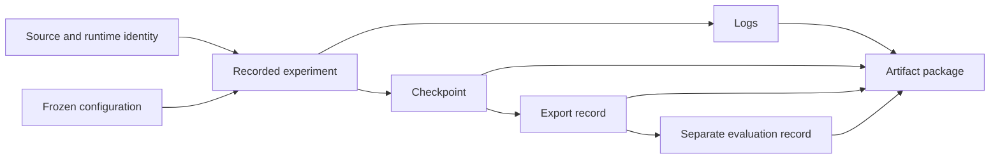

# From an experiment to a reviewable result

Our development work produced more than checkpoints and videos. We built the surrounding records and tools needed to identify which source, configuration and recorded run produced an artifact. The public [pipeline evidence toolkit](../../software/README.md) is one usable part of that work. The wider archive also contains experiment packaging and media-review tooling.

## Give each boundary a clear contract

A robotics project joins components that run at different rates and use different representations. An adapter translates an external representation into the project’s declared units and frame. A processing component consumes that contract. An evaluator records what happened. Keeping those responsibilities separate makes it possible to test a conversion independently of an experiment, or investigate a recording without running the original device.

The original project documented this interface discipline in Python dataclasses and portable JSON schemas. Changing a field’s meaning, units or requiredness was treated as an interface change. A familiar field name is insufficient if two components disagree about its interpretation.

The published toolkit applies the same approach to timestamps and recorded pipeline events. A parser checks input structure before the assessor calculates timing metrics. The [software walkthrough](../../software/engineering.md) explains how strict types, causal ordering and stream coverage are handled in the implementation. Those checks make a malformed capture distinguishable from a well-formed capture that does not meet its declared measurement conditions.

## Preserve the links between artifacts

A training checkpoint and an inference export are different artifacts. The former can contain optimizer and preprocessing state used to resume an experiment. The latter is an executable representation intended for a particular runtime. The archived project includes export and manifest logic to retain their relationship, including the source checkpoint identity and associated configuration.

This distinction shaped our documentation: a recorded export operation, a replay and a separate evaluation are described as separate steps. An exported file should remain associated with the experiment that produced it, rather than being renamed and detached from that context.

This diagram describes artifact relationships in the development workflow. It is not a claim that every archived experiment reached every stage.

## Make a package recoverable

The archive contains implemented builders for bounded evidence packages. They check identified input records, assemble a package in a staging directory and calculate relative-file checksums. Completion is recorded before the package becomes the final directory. A no-overwrite operation preserves an existing package instead of silently replacing it.

The practical benefit is that someone inspecting a package can distinguish a completed export from an interrupted folder copy. A checksum identifies bytes; the surrounding manifest supplies their meaning. Both are needed. Neither a checksum nor a successful packaging operation establishes the experiment’s task performance.

A separate builder preserves a fixed set of historical failure records with the same packaging discipline. Those records remain in the private archive. Keeping them supports later diagnosis while the public chapters focus on the implemented methods and completed work.

## Treat media as another derived artifact

The project’s media QA tooling separates technical inspection from visual review. Technical checks inspect an encoded file and compare it with its declared format. Visual review considers whether the subject and labels are readable and whether the image contains unintended cropping, stretching or rendering defects.

The candidate record can bind the video to supporting footage, telemetry and its run identity. A subsequent publication step rechecks linked bytes so that changing a video after review does not silently preserve the old review outcome. Implementing this workflow is distinct from a particular candidate completing it.

Our [gallery](../../media/README.md) therefore labels each published clip for its actual role: checkpoint playback, baseline course visualization, camera development or a physical prototype recording. Readers can follow an image into the relevant chapter without confusing the way a clip was produced with the capability it demonstrates.

## Source basis

This public explanation is grounded in the dated project records identified in the [source records for this chapter](../../results/source-records.md#chapter-docs-artifact-lineage-md). The catalogue distinguishes complete notices from adapted explanations and preserves separate document versions.
