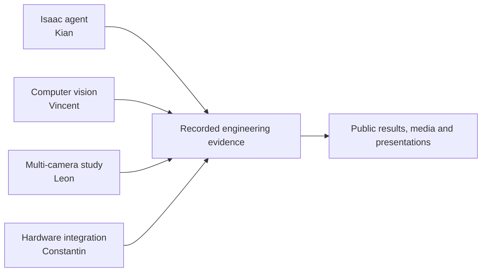

# Warden subsystem map

Warden development covered four distinct engineering tracks. Each track has its own owner, evidence and interface.

| Subsystem | Contributor | Public explanation |
| --- | --- | --- |
| Isaac Sim autonomy and learning | Kian | [Isaac agent](isaac-agent.md) |
| Supervised computer vision | Vincent | [Computer-vision model](computer-vision.md) |
| Multi-camera sensing study | Leon | [Warden Corps camera network](multicamera-sensing.md) |
| Physical airframe and electronics | Constantin | [Hardware integration](hardware-integration.md) |

The tracks remain technically distinct. The public record connects them through documented interfaces and team responsibilities without treating separate experiments as one integrated flight demonstration.

[Verified results](../../results/README.md) · [Presentation materials](../presentations/README.md) · [Contributors and rights](../../licensing/contributors-and-rights.md)
