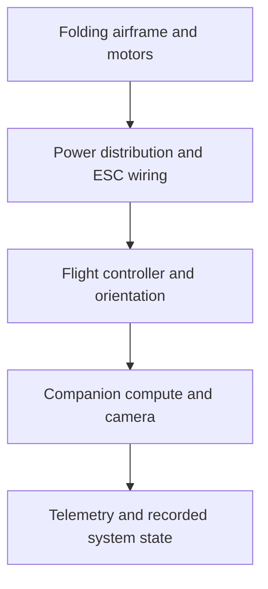

# Physical airframe and electronics

[Constantin · Takane0](https://github.com/Takane0) led the physical FPV prototype and the flight-controller/electronics integration work. The retained media shows the folding airframe, motors, wiring, electronics packaging and outdoor hover.

## Intended integration layers

This diagram describes the intended packaging layers, not a verified end-to-end stack. The physical work gives the autonomy and perception software a real packaging target: the airframe must carry power electronics, flight control, compute, sensing and telemetry inside a constrained folding structure.

| View | Record |
| --- | --- |
| Assembly and wiring |  |
| Open configuration |  |
| Folded configuration |  |
| Outdoor hover |  |

The separate LL-11 package adds editable parametric landing-leg geometry, STEP/STL exchange files and digital integrity checks. See [hardware](../../hardware/README.md).

## Dated assembly and integration record

Kian’s August 29 report states that the first prototype was assembled and most internal power wiring was complete. Motor-direction problems and cable/layout work remained under investigation. Flight-controller orientation, companion-computer/camera installation, landing legs and branding were listed as next steps, not completed integration tests.

Later photographs document the folding structure and electronics packaging. The supplied recording shows physical hover, but does not record its control mode or demonstrate a learned policy driving the airframe.

The September 4 commissioning account records successful companion-host/dashboard checks followed by loss of connectivity after the flight controller was connected. This is a separate host-integration record, not evidence of resolved controller integration. Its software authorship is not assigned to Konstantin solely from his hardware role.

Konstantin is spelled Constantin in the earlier project records. [Team attribution](../project/team.md) preserves both spellings. [Source records](../../results/source-records.md) include the dated physical prototype update, DOC-9a6d109e0763; its historical evidence and open issues are retained.
