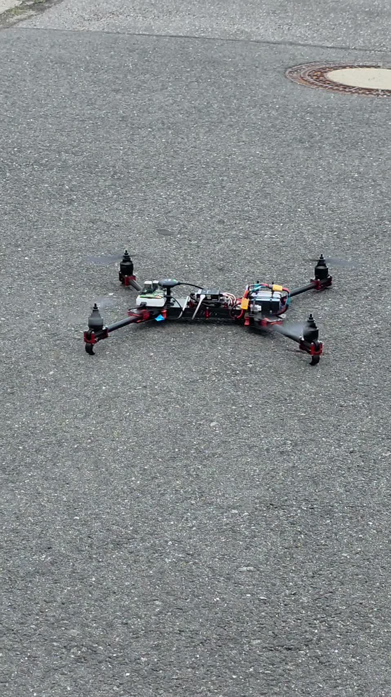

# A visual walkthrough of the engineering

The project developed through physical assembly, simulation experiments, instrumentation and CAD iteration. This walkthrough explains what the different images show and how they relate to the source and recorded work.

## 1. Open the frame and inspect the assembly

The assembly photograph shows the carbon-fibre structure, arm mounts, motors, wiring and electronic components before the upper frame is closed. It provides a useful view of the packaging problem: mechanical structure and electrical routing occupy the same limited space. The image records the actual build rather than a CAD proposal.

| Arms open | Folded configuration |
| --- | --- |
|  |  |

The two configurations show the folding frame and the placement of components along its centre. They document the physical arrangement directly. Detailed electrical schematics and operating instructions are outside this public collection.

## 2. See the physical prototype outdoors

| Outdoor assembly detail | Hover recorded in supplied footage |
| --- | --- |
|  |  |

The supplied video shows the physical prototype airborne and hovering. [Watch the recorded demonstration](../media/physical/prototype-hover.mp4?raw=1). This is a concrete physical-build result. The public copy retains the full recording duration and presents the visible physical-build achievement directly.

These images do not identify an installed LL-11 landing leg. The CAD work below is a separate design record.

## 3. Follow autonomous flight and camera views

The verified 15-second corridor demonstration shows the physically simulated Iris surrogate progressing under a model-based autonomous trajectory controller. The retained runtime and independent review record 450 frames, 15.485 metres of travel, zero collisions and zero safety interventions.

| Chase camera | First-person camera |
| --- | --- |
|  |  |

The mapped-course clips use a verified PX4-style behavioral baseline. The chase view gives external spatial context, while the first-person view shows the camera-relative scene. The Iris surrogate in these renders is an upstream simulation asset, separate from the physical frame shown above. [Credits](../third_party/README.md) identify the upstream work.

## 4. Follow the landing-leg geometry

LL-11 combines a mounting head, two swept chords, five connected bowed diagonals and an integral skid. The [hardware engineering walkthrough](../hardware/engineering.md) connects those features to the parameterized source, Boolean construction and export checks.

The layer samples show where the recorded slice places material at different heights. This adds a second view of the design beyond the rendered outer shape: connections and clearances must still exist in the toolpath representation. The plot preserves its original digital-check scope.

The mechanics screen displays a numerical frame model and magnified displacement. Its labels distinguish the calculation from a measured physical load rating. Read the assumptions with the geometry rather than treating a coloured line plot as a test certificate.

## 5. Connect visuals to records

The images are backed by source files, media identities and documented scope. [Software engineering](../software/engineering.md) explains the event and capture contracts; [reproducibility](reproducibility.md) explains how hashes, original files and public viewing copies are kept distinct. This lets a reader move from a picture to the implementation or the record that gives it meaning.

## Source basis

The [source records for this chapter](../results/source-records.md#chapter-docs-visual-walkthrough-md) identify the archived versions used in this public explanation.
