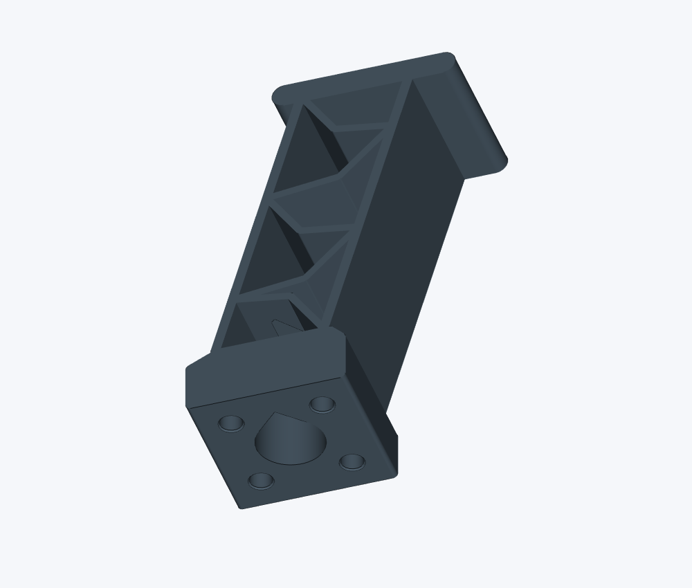

# LL-11 landing-leg prototype



A one-piece landing leg with five connected web panels, bowed diagonals and an integrated insert carrier. The thin web and broad-side print orientation were developed around a PAHT-CF prototype. This is a digital design example, not qualified landing gear.

The nominal envelope is 47.3 × 65.1 × 28 mm. Swept chords are 1.6 mm wide; the bowed braces are 1.2 mm wide. The mounting holes and clearances are provisional interface dimensions, not a universal mounting standard.

## Files

- `generate_leg.py`: standalone parametric CadQuery source.
- `cad/LL11_leg.step`: editable solid geometry.
- `cad/LL11_leg.stl`: millimetre mesh in the intended broad-side print orientation.
- `images/LL11_leg.png`: rendered CAD preview, not a photograph of a printed part.

## Reproduce

Use Python 3.12 and CadQuery 2.8.0 in an isolated environment:

```sh
python -m pip install cadquery==2.8.0
python generate_leg.py --out generated
```

The generator exports the leg alone and checks that it is one valid solid and that STEP export preserves its volume and bounding box. It requires no reference plate, printer profile or private project files. Outputs go into `generated/`; the supplied CAD files remain unchanged.

## Checks on this package

The nine geometry-building functions are unchanged from the original LL-11 design. The source passes a syntax check; the STEP, STL and preview preserve that revision. The STL has 5,862 triangles with no boundary or nonmanifold edges.

Generating the CAD from this standalone source still needs a clean-environment check. The local CAD environment failed to finish loading during packaging, so the generator’s export checks have not been rerun for this release.

## Engineering limits

Digital solid and export checks do not establish print quality, installed fit, insert retention, buckling resistance, fatigue, damping or landing capacity. Material properties and print orientation require separate qualification. No completed print or physical load test is claimed here.

The mounting interface was developed from an estimated reference geometry. Measure the real interface and check the complete load path before considering fabrication. The supplied files contain no printer commands or flight-control integration.
