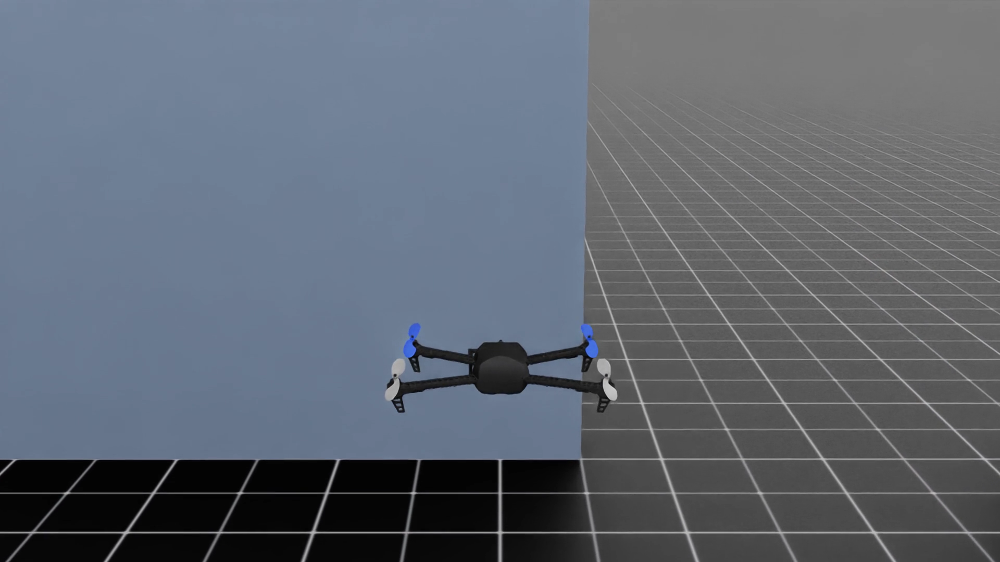

# Building Warden Core

A look at the hardware assembly, folding frame and simulation development.

Rights differ by file. Project-created simulation media is available noncommercially under CC BY-NC-SA 4.0, subject to upstream notices. The physical photographs and hover footage are excluded pending confirmation of the photographer or videographer's rights. See the exact [media rights map](LICENSE.md).

## Assembly and wiring

The frame opened up during assembly, showing the wiring, motor mounts and electronics.

## Open configuration

The prototype laid out on a table with its arms open.

## Folded configuration

The same build with its arms folded alongside the frame.

These photographs document assembly and configuration. They do not establish flight performance or autonomous operation, and they do not show validation of the separate LL-11 landing-leg design.

More behind the scenes: [EDTH Instagram highlight](https://www.instagram.com/stories/highlights/17880192807625231/).

## Development videos

### Model-based autonomous corridor flight

[Watch the 15-second autonomous corridor demonstration](autonomous/corridor-flight.mp4?raw=1). The physically simulated Iris surrogate travels 15.485 metres through the recorded fictional corridor scenario. Runtime and independent QA recorded 450/450 frames, zero collisions, zero command saturations, zero safety interventions and successful technical, motion, visual and provenance review.

### Verified simulation montage

[Watch the 34.5-second simulation reel](simulator/development-montage.mp4?raw=1). Title cards separate exterior camera calibration, mapped-course chase and first-person views. All three source clips passed full decode and representative-frame review.

### Virtual-camera calibration

[Watch the 10-second camera-calibration render](simulator/camera-calibration.mp4?raw=1). The exterior camera moves around the Iris surrogate and demonstrates the direct virtual-camera capture workflow.

Both videos are compressed viewing copies of retained project renders. No third-party SDK or raw robot asset is bundled. The Iris surrogate is an upstream model, not our physical airframe. See [media credits](../third_party/README.md).

## Gate-course development

### Mapped-course chase view

[Watch the ten-second chase view](simulator/mapped-course-chase.mp4?raw=1). The verified PX4-style behavioral baseline records the mapped course from an external tracking camera.

### Mapped-course first-person view

[Watch the ten-second first-person view](simulator/mapped-course-fpv.mp4?raw=1). This is another camera view of the baseline workflow. Both course videos retain their full original duration, with descriptive overlays added for this public copy. See [upstream credits](../third_party/README.md).

## Outdoor physical-prototype recording

[Watch the supplied hover recording](physical/prototype-hover.mp4?raw=1). The airframe is visibly airborne and demonstrates the assembled physical prototype in flight. The public copy retains the full visual duration; the full original remains in the project library.

[More images with engineering explanations](../docs/media/README.md).

[Complete flight-media provenance and measurements](provenance.md).
