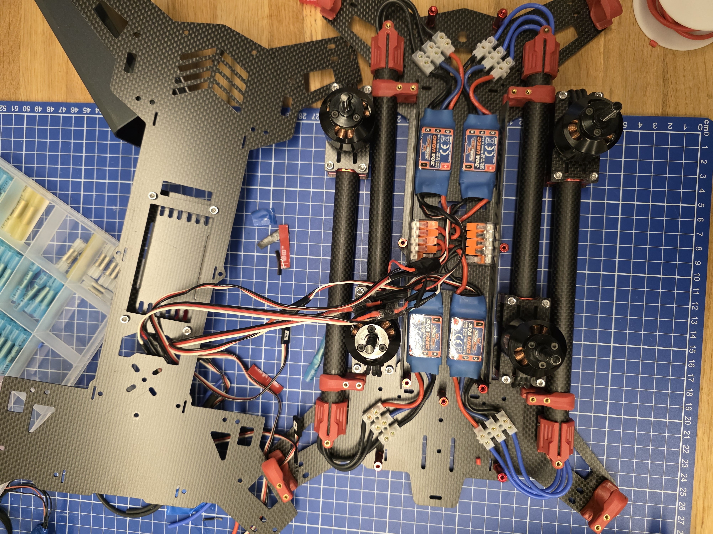
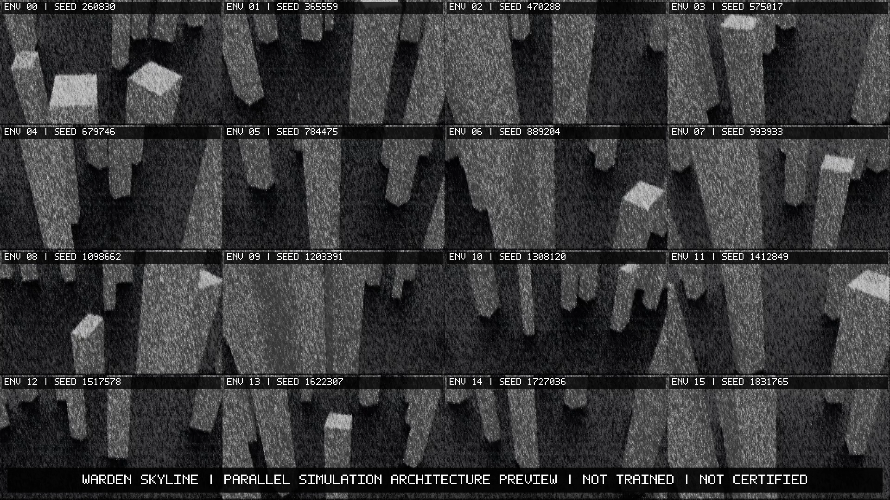

# Building Warden Core

A look at the hardware assembly, folding frame and simulation development.

## Assembly and wiring

The frame opened up during assembly, showing the wiring, motor mounts and electronics.

## Open configuration

The prototype laid out on a table with its arms open.

## Folded configuration

The same build with its arms folded alongside the frame.

These photographs document assembly and configuration. They do not establish flight performance or autonomous operation, and they do not show validation of the separate LL-11 landing-leg design.

## Simulation development

A development preview of parallel simulated environments. The original “not trained” and “not certified” labels are retained; this image is not a trained-policy result.

More behind the scenes: [EDTH Instagram highlight](https://www.instagram.com/stories/highlights/17880192807625231/).
