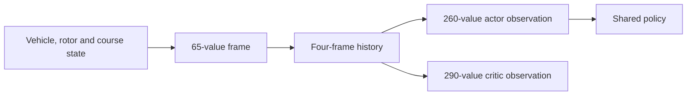
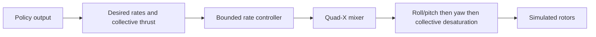

# Observation and action contracts

The Warden Core policy interface separates the information available to the actor from the richer context available to the critic during training.

## Timing contract

| Loop | Recorded rate |
| --- | ---: |
| Simulated physics and inner control | 250 Hz |
| Policy decisions | 50 Hz |
| Physics steps per policy decision | 5 |

The exact 5:1 timing relationship is checked as part of the public Phase A contract record.

## Observation contract

A single frame contains 65 values. Four frames form the actor history:

$$
4 \times 65 = 260.
$$

The actor receives the 260-value history used to produce the next bounded action. The critic receives a separate 290-value training representation with additional simulator context.

## Action and control contract

The policy action represents mass-normalized collective thrust and desired body rates. The downstream control layer applies bounded rate control, quad-X rotor allocation, anti-windup, slew limiting, motor lag and ordered desaturation.

The public [system architecture](../docs/simulation/architecture.md) shows this interface in the full Isaac Sim loop. The [verified results](../results/README.md) record the completed contract, dynamics and replay checks.
