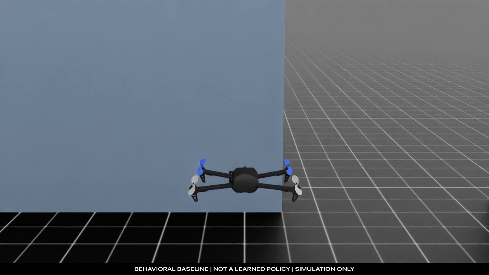

# Annihilation Industries · Warden Core

**A simulation-first robotics project combining experimental learning, computer vision, software instrumentation and hardware development.**

I led Annihilation Industries at the European Defense Tech Hackathon in Hamburg, connecting the simulation and evaluation work with the team’s hardware, perception and sensing contributions. Vincent developed the separate computer-vision baseline, [Constantin](https://github.com/Takane0) led physical airframe and electronics integration, and Leon developed the related Warden Corps multi-camera sensing study and presentation.

This repository explains how the project works and shares selected development footage, build photographs, a runnable observability toolkit and editable landing-leg CAD. The runnable component is the standalone pipeline observability package; the wider simulation, perception and hardware work is documented alongside it.

The project remains unfinished. [Team contributions](../project/team.md) and [unfinished work](../project/history.md) distinguish each person’s outputs from planned integration.

## Start here

| Question | Go directly to |
| --- | --- |
| **What did Warden Core achieve?** | [Verified results](../project/evidence/README.md) and [machine-readable results](../project/evidence/verified-results.json) |
| **How does the system work?** | [System architecture](../subsystems/simulation/docs/architecture.md) |
| **Where are the reward and policy specifications?** | [Policy and mathematics index](../subsystems/simulation/reward-and-evaluation/README.md) |
| **How does each subsystem work?** | [Subsystem and contributor map](../subsystems/README.md) |
| **Where are the evidence identities?** | [Run identities](../subsystems/simulation/results/run-identities.md) and [source records](../project/evidence/source-records.md) |
| **Where are the flight videos?** | [Media gallery](../project/media-gallery.md) and [media provenance](../project/evidence/media-provenance.md) |
| **Where are the presentation materials?** | [Public presentation package](../project/presentations/README.md) |
| **How can I run the public software?** | [Warden observability](../subsystems/observability/README.md) |
| **What can I use for education or research?** | [Licensing guide](../licensing/README.md) |
| **How do I request model access?** | [Closed-source model access](../licensing/model-access.md) |

## Repository map

See the [subsystem-first repository structure](repository-structure.md).

## Subsystems and contributors

| Contributor | Subsystem | What the public record explains |
| --- | --- | --- |
| **Kian Tajbakhsh** | [Isaac Sim agent](../subsystems/simulation/README.md) | Brev/Isaac environment, observation and action interface, reward policy, training, evaluation, telemetry, rendering and evidence. |
| **Vincent** | [Computer vision](../subsystems/perception/README.md) | Frozen ResNet18 features, linear six-class head, offline training/evaluation and explicit unknown behavior. |
| **Leon** | [Multi-camera sensing](../subsystems/multicamera-sensing/README.md) | Related Warden Corps five-camera geometry, radiometry, 3-of-5 coincidence, sparse voxel tracking and presentation. |
| **[Constantin](https://github.com/Takane0)** | [Hardware integration](../subsystems/airframe/docs/integration.md) | Physical FPV prototype, folding airframe, flight-controller/electronics integration and hover record. |

[Public presentation package](../project/presentations/README.md) · [Contributors and rights](../licensing/contributors-and-rights.md)

## Verified engineering highlights

| Completed result | Recorded outcome |
| --- | --- |
| Real Isaac dynamics qualification | 800 cases, 526,800 telemetry records, 400 exact replay pairs, zero failures |
| Parallel GPU scale profile | 15 real-Isaac runs; 2,048 environments selected at 64,094.408 transitions/s |
| Stage 0 shared-policy training | 10 accepted updates and 1,310,720 accepted transitions across 2,048 environments |
| Autonomous corridor demonstration | 15 seconds, 450 frames, 15.485 m travel, zero collisions or safety interventions |
| Engineering contract suite | 409 full tests, 139 focused tests, schema/Ruff/syntax checks passed |

[Read the full verified results](../project/evidence/README.md) · [Explore the system architecture](../subsystems/simulation/docs/architecture.md)

## Watch the simulation work

| Autonomous trajectory control | Verified simulation montage |
| --- | --- |
| [](../subsystems/simulation/media/autonomous/corridor-flight.mp4?raw=1) | [](../subsystems/simulation/media/simulator/development-montage.mp4?raw=1) |
| **Model-based autonomous corridor flight.** A 15-second, 450-frame direct Isaac Sim render with zero collisions, command saturations or safety interventions in the recorded scenario. | **Isaac Sim development reel.** Camera calibration plus chase and first-person views from the verified mapped-course behavioral baseline. |

[Flight-media provenance and measurements](../project/evidence/media-provenance.md)

## Additional verified views

| Mapped-course chase camera | Mapped-course first-person camera |
| --- | --- |
| [](../subsystems/simulation/media/simulator/mapped-course-chase.mp4?raw=1) | [](../subsystems/simulation/media/simulator/mapped-course-fpv.mp4?raw=1) |

[Physical prototype hover](../subsystems/airframe/media/prototype-hover.mp4?raw=1) · [Visual engineering walkthrough](../project/visual-walkthrough.md)

## Explore the engineering in depth

| Walkthrough | What it explains |
| --- | --- |
| [Software internals](../subsystems/observability/engineering.md) | Typed events, timestamp ordering, capture assembly, input hashing and assessment behavior. |
| [Computational geometry studies](../subsystems/airframe/landing-gear/computational-geometry.md) | The separate PicoGK branch: field/lattice/frame representations and recorded digital checks. |
| [Experiment artifacts](../subsystems/simulation/docs/artifact-lineage.md) | How source revisions, checkpoints, exports and media retain their relationships. |
| [Hardware development](../subsystems/airframe/landing-gear/engineering.md) | Connected-web topology, parametric geometry, STEP/STL integrity and slice-level checks. |
| [Visual record](../project/visual-walkthrough.md) | Build photographs, outdoor hover, simulation cameras and CAD visualizations. |
| [Reproducibility](../project/reproducibility.md) | How source, checkpoints, media and published copies retain their identities. |
| [Verified results](../project/evidence/README.md) | Real-Isaac integration, dynamics, replay, scale profiling, training execution and autonomous corridor results. |
| [System architecture](../subsystems/simulation/docs/architecture.md) | Cloud, simulator, observation, control, reward and evidence layers. |
| [Flight media](../project/evidence/media-provenance.md) | Video provenance, exact measurements and the role of each published clip. |

## How the pieces fit together

The project developed four engineering tracks with separate owners and evidence:

| Track | Input and processing | Public output |
| --- | --- | --- |
| Isaac agent | Brev GPU workspace → Isaac Sim scenes → policy/control loop → deterministic evaluation | Run identities, telemetry results and reviewed flight media |
| Computer vision | Collected stills → frozen ResNet18 features → linear six-class head | Offline evaluation and error analysis |
| Multi-camera sensing | Five monochrome camera bearings → 3-of-5 voxel coincidence → worldline | Leon’s Warden Corps sensing study and presentation figures |
| Physical integration | Folding airframe → motors/electronics → flight controller and companion compute | Assembly record, CAD package and outdoor hover media |

All four tracks contribute to the documented engineering record while retaining their individual experiment and ownership boundaries.

## Simulation on NVIDIA Brev and Isaac Sim

Brev supplied the remote GPU workspace. Isaac Sim supplied the scene, robot simulation and virtual cameras, while Isaac Lab supported robot-learning experiments. The local computer was used for development, viewing and preserving the outputs.

Archived runs used Isaac Sim 4.5.0. Early setup records identify Isaac Lab 2.1.0; later Skyline capture records identify 2.1.1. These are historical environment records, not a promise that any mixture of current packages will reproduce the old runs.

The development workflow kept source/configuration identity, logs, checkpoints and media together. Headless experiments and visible scene inspection were separate activities, so a working viewer or an attractive render did not stand in for a successful evaluation.

[Simulation setup and architecture](../subsystems/simulation/docs/simulation.md) · [Sources and upstream tools](../project/sources.md)

## How the learning workflow works

In reinforcement learning, a policy produces an action from an observation of the simulated environment. The simulator advances, returns the next observation and a reward, and the learning process updates the policy using the collected experience. Repeating that loop creates training data; it does not automatically produce a useful controller.

Our development records distinguish these steps:

1. **Establish the environment.** Check scene construction and small, repeatable runs before longer experiments.
2. **Record the experiment.** Keep the source revision, runtime identity, configuration and seed with the run.
3. **Train and save state.** Preserve logs and checkpoints so the experiment can be inspected and recovered.
4. **Evaluate separately.** Judge a fixed candidate under recorded conditions instead of treating the training reward as proof of task completion.
5. **Inspect behavior.** Use footage together with the run records to understand what happened.
6. **Preserve the handoff.** Export the files and their checksums before relying on a cloud workspace as the only copy.

The retained archive includes source-linked experiment configurations, logs, closed-source checkpoints, evaluation records and reviewed camera output.

[Training and evaluation documentation](../subsystems/simulation/docs/training.md) · [Exact acro-racing reward policy](../subsystems/simulation/reward-and-evaluation/reward-policy.md) · [Source coverage](../project/source-coverage.md)

The model weights and exported policy artifacts are closed source and are not present in this repository. Commercial, education and academic requests are handled through the [model-access policy](../licensing/model-access.md).

## Computer vision and the dataset

Vincent’s offline baseline used ImageNet-pretrained ResNet18 features and a linear classification head trained on CPU. Freezing the visual backbone separated representation extraction from the smaller classification experiment. The retained package includes training records, a checkpoint, a confusion matrix and error analysis across six aircraft/background classes.

The recorded partitions contain 1,331 training, 283 validation and 291 test images. The later preserved collection contains 1,853 images and differs from the training-era inventory. The original notes also identify near-duplicates crossing partition boundaries. Consequently, we do not use the historical score as a claim of real-world recognition performance.

This was still-image classification, not demonstrated recognition during flight. Raw images, embeddings and weights are not distributed here because their complete source and reuse permissions have not been established.

[Computer-vision workflow](../subsystems/perception/docs/README.md) · [Dataset versions and limitations](../subsystems/perception/docs/dataset.md)

## Physical prototype and CAD

| Open prototype | Folded configuration |
| --- | --- |
|  |  |

The photographs document frame assembly, electronics and the folding configuration. The supplied outdoor recording also shows the physical prototype hovering.

<a href="../subsystems/airframe/media/prototype-hover.mp4?raw=1"></a>

*Recorded physical hover. The recording does not document the control mode; it is separate from the simulation-learning experiments.*

A separate LL-11 landing-leg design is included as parametric CadQuery source, STEP and STL files. The geometry remains editable and the exchange files can be inspected without running the generator.


*LL-11 digital design, separate from the photographed frame assembly. Geometry checks and design scope are recorded with the CAD files.*

[Hardware files and reproduction notes](../subsystems/airframe/landing-gear/) · [Detailed CAD engineering](../subsystems/airframe/landing-gear/engineering.md) · [Assembly photographs](../project/media-gallery.md)

## Try the software

The independently runnable package records event timings, assembles local logs and assesses pipeline measurements. It reports latency, throughput, resource use and missing provenance. A recorded “command” event contains only a timestamp and validity flag, not a vehicle command.

With Python 3.11 or newer, from the repository root:

```sh
cd subsystems/observability
python3 -m venv .venv
. .venv/bin/activate
python -m pip install -e .
warden-record-events --output outputs/events.jsonl < examples/events.jsonl
warden-assemble examples/metadata.json outputs/events.jsonl examples/resources.jsonl \
  --capture-output outputs/capture.json --assessment-output outputs/assessment.json
```

The included example is synthetic. Assembly intentionally returns exit code **2** and `passed: false`; it does not manufacture a hardware pass. Output paths must be new. The package had 44 passing tests at publication, and no vehicle connection is required to try it.

[Full software instructions and tests](../subsystems/observability/)

## Repository guide

See the [subsystem-first repository structure](repository-structure.md).

## Licensing

This repository uses a scoped noncommercial licence model:

- project-owned code in `subsystems/observability/` and `tools/` uses the [PolyForm Noncommercial License 1.0.0](../licensing/licenses/PolyForm-Noncommercial-1.0.0.md);
- project-owned documentation, diagrams and specifically identified media use [CC BY-NC-SA 4.0](../licensing/licenses/CC-BY-NC-SA-4.0.md);
- project-owned hardware and CAD use the [Warden Core Hardware Research and Education License 1.0](../licensing/licenses/Warden-Core-Hardware-Research-and-Education-1.0.md); and
- third-party, teammate-owned and rights-unconfirmed material is excluded and remains subject to its own rights and notices.

Noncommercial education, personal experimentation and academic research are permitted within the applicable terms. Commercial use requires a [separate written paid agreement](../licensing/commercial-licensing.md). Read the complete [licence map](../LICENSE.md) and the centralized scoped notice in `licensing/scopes/` before reusing a file.


## Use the workflow in your own project

We also maintain [Isaac Sim and Brev Operations](https://github.com/Kian-hdr/isaac-sim-brev-operations), a reusable skill for Codex and other AI coding assistants. It explains the workflow and provides project-documentation templates, validation tools and guidance for organizing experiments, preserving outputs and managing GPU work.

Start with its [copy-ready setup prompt](https://github.com/Kian-hdr/isaac-sim-brev-operations/blob/main/SETUP_PROMPT.md). The skill is a workflow/documentation toolkit; install and configure the simulator and cloud environment separately for your project.

## Behind the scenes

My [EDTH Instagram highlight](https://www.instagram.com/stories/highlights/17880192807625231/) shows more of the build process. Instagram may require sign-in.

Kian Tajbakhsh · [GitHub](https://github.com/Kian-hdr) · [Repository scope](../project/scope.md) · [Licence map](../LICENSE.md)

## Source basis

The [source records for this chapter](../project/evidence/source-records.md#chapter-readme-md) identify the archived versions used in this public explanation.
