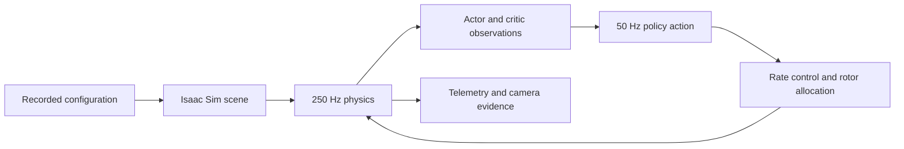
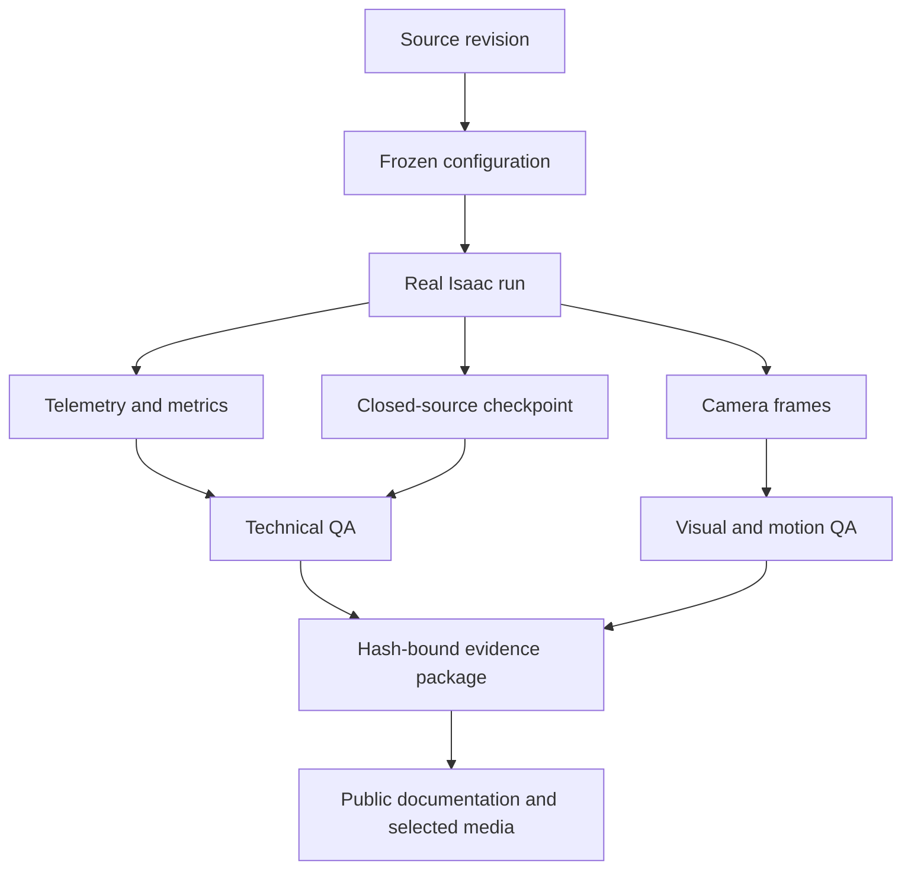

# Verified engineering results

This page collects completed, source-backed results from the Warden Core development archive. Each number below is tied to a retained run, revision, checksum ledger or independent media review.

The same values are available as a machine-readable [`verified-results.json`](verified-results.json) record.

[Run and evidence identities](../../subsystems/simulation/results/run-identities.md) · [Machine-readable results](verified-results.json) · [Public source records](source-records.md) · [Media manifest](../../subsystems/simulation/media/manifest.json) · [Policy specifications](../../subsystems/simulation/reward-and-evaluation/README.md)

## Results at a glance

| Engineering result | Verified outcome |
| --- | --- |
| Control and learning contracts | 409 full tests, 139 focused tests, Ruff, schema validation and syntax compilation across 119 files passed at the Phase A checkpoint. |
| Real Isaac Sim integration | 32 parallel environments completed 180 policy steps and 900 physics steps with finite state/actions, contact truth and camera truth. |
| Dynamics qualification | 800 scenario/seed cases produced exactly 526,800 telemetry records across two fresh 400-lane Isaac processes with zero failures and 400 exact replay pairs. |
| Recovery repeatability | 32 hard-recovery cases ran in two independent Isaac processes; every CPU comparison matched exactly, every case remained contact-free, and recovery completed within 1.208 seconds. |
| GPU scale profiling | 15 real-Isaac profiling runs covered five environment counts and three seeds. The recorded rule selected 2,048 parallel environments at 64,094.408 transitions/second with at least 94.519% VRAM headroom in every seed. |
| Stage 0 training execution | A shared policy completed ten accepted optimizer updates across 2,048 environments and 1,310,720 accepted transitions. |
| Autonomous corridor demonstration | A model-based trajectory controller completed a 15-second, 450-frame simulated corridor flight with 15.485 metres of travel, zero collisions, zero command saturations and zero safety interventions. |
| Offline perception baseline | The six-class held-out evaluation recorded 89.1% accuracy and 0.863 macro-F1 on 64 images. |
| Editable hardware package | The LL-11 package includes parametric source, STEP and STL; the retained STL contains 5,862 triangles with no boundary or nonmanifold edges. |

## From contracts to real Isaac execution

The first engineering gate established the project’s control, observation, course and reward contracts before GPU execution. The completed checkpoint covered:

- a 250 Hz simulated inner loop and 50 Hz policy loop with an exact 5:1 relationship;
- rate control, quad-X mixing, desaturation, anti-windup, latency, slew, motor lag, battery and rotor state;
- a 65-value frame representation, 260-value actor observation and separate 290-value critic observation;
- ordered course coordinates and collision-aware swept-hull gates;
- the bounded reward ledger and terminal-dominance invariant documented in the [reward-policy chapter](../../subsystems/simulation/reward-and-evaluation/reward-policy.md); and
- a simulation-only safety profile with physical output inhibited.

The next gate instantiated this stack in Isaac Sim 4.5.0 and Isaac Lab 2.1.1 on an NVIDIA RTX PRO 6000 Blackwell Server Edition. Thirty-two parallel environments advanced through 180 policy decisions and 900 physics steps. The runtime returned finite observations and actions, recorded contact state, and captured three camera frames. This verified the complete simulator adapter path from scene construction through observations and control.

## Dynamics and deterministic replay

The Phase C qualification exercised 800 frozen scenario/seed cases across two fresh 400-lane Isaac processes. The run produced exactly 526,800 telemetry records and preserved all required aggregate metrics. Every state and action was finite, all 400 replay pairs matched exactly at the frozen comparison bound, and the final result contained zero failures.

The mixer checks also matched the expected quad-X sign matrix and the intended roll/pitch, yaw, collective desaturation priority. The maximum recorded GPU-versus-scalar mixer difference was approximately `1.49e-8`.

A separate repeatability probe exercised 32 hard-recovery cases in two independent real-Isaac processes. Each process generated 24,000 transitions. The resulting case records matched exactly across both executions, all cases were contact-free, and the longest recorded recovery time was 1.208 seconds.

## Parallel simulation scale

The scale profile crossed five environment counts (`128`, `256`, `512`, `1,024`, and `2,048`) with three seeds, producing 15 real-Isaac runs. Every result completed with consistent runtime identity, verified checkpoint hashes, numeric parity and safety checks.

The frozen selection rule chose the smallest environment count within 3% of maximum stable throughput while preserving at least 15% VRAM headroom in every seed. It selected:

| Metric | Recorded value |
| --- | ---: |
| Parallel environments | 2,048 |
| Stable throughput | 64,094.408 transitions/s |
| Maximum measured stable throughput | 64,094.408 transitions/s |
| Minimum per-seed VRAM headroom | 94.519% |
| Real-Isaac profiling runs | 15 |

This profiling work established a measured operating point for the training system instead of selecting parallelism from a single run.

## Stage 0 policy training

The retained Stage 0 training package records ten accepted optimizer updates from one shared policy across 2,048 parallel environments. With 64 rollout steps per update, the run accumulated 1,310,720 accepted policy transitions. The package binds the run request, metric stream, result, checkpoint index, runtime identity and budget lineage through SHA-256 ledgers.

Model weights are intentionally absent from this repository. They remain closed-source project artifacts governed by the [model-access policy](../../licensing/model-access.md).

## Verified simulated autonomous flight

The project also completed a model-based autonomous trajectory-controller demonstration in a fictional skyscraper corridor. The direct chase-camera render contains 450 frames at 1,920 × 1,080 and 30 fps. Runtime and independent review recorded:

- 15.000 seconds of continuous simulated flight;
- 15.485 metres maximum displacement;
- 1.735 m/s maximum speed;
- zero collisions and zero flight-volume violations;
- zero safety interventions and zero command saturations;
- all 450 source frames present and all 450 decoded frame hashes unique; and
- successful technical, motion, visual and provenance review.

[Watch the autonomous corridor demonstration](../../subsystems/simulation/media/autonomous/corridor-flight.mp4?raw=1) or read its [media provenance](media-provenance.md).

## Evidence engineering

The work was recorded as a chain of identifiable artifacts rather than isolated screenshots. Frozen configurations, runtime identities, telemetry, checkpoints, evaluation summaries, media candidates and checksum ledgers remain connected by run IDs and source revisions.

The public [observability toolkit](../../subsystems/observability/README.md) demonstrates the same design principles with strict event parsing, causal timestamp checks, content hashing and non-overwriting outputs.

## Evidence identities

| Result | Retained identity |
| --- | --- |
| Phase A contracts | `phase-a-20260830T023006Z-ba7ed1a` |
| Phase B integration | `20260830-015612-7ea4ee` |
| Phase C dynamics | `warden-phase-c-full-gate-68ad1a7-20260830t060800z` |
| Recovery pair | `warden-phase-c-recovery-process-pair-2472bca-20260830t054633z` |
| Scale profile | `warden-scale-ladder-2b54a2f-20260830t071219z` |
| Stage 0 training | `warden-phase-d-stage0-tranche02-e2048-u10-s4409-50185db-20260830t081630z` |
| Autonomous corridor media | SHA-256 `de2629261c7be02d4c2c1ae0d5154b5c0f318e4765820539269430918fa319ee` |

These identities make the published results traceable to the retained private engineering archive without distributing model weights or private operational material.
