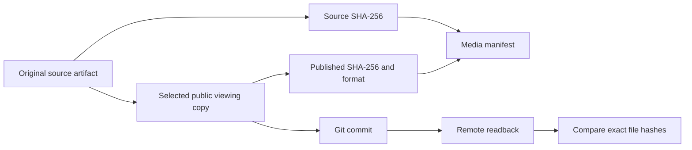

# Reproducibility and artifact handling

The project’s records connect source, inputs, outputs and the context in which an experiment ran. This is useful engineering work in its own right: a checkpoint, a photograph and an edited clip answer different questions, so they need enough surrounding information to remain interpretable.

## What we preserved

The consolidated project library retains development-source snapshots, Git-history bundles, experiment configurations, training and evaluation records, checkpoints, CAD revisions, original media and checksum manifests. Source originals were preserved during consolidation. The public repository is a reviewed selection from that library, with its own clean history and a corresponding local source snapshot.

For the public media, [manifest.json](../subsystems/simulation/media/manifest.json) records the published file identity, the original source hash, technical format and the role of the recording. Viewing copies may have been compressed, stripped of metadata or given a scope label. Their hashes therefore differ from the originals, and both identities are retained.



## What a checksum does

A SHA-256 digest gives a compact identity for file bytes. Comparing the original and copied file hashes checks whether the copy changed. Comparing the reviewed public tree with a fresh remote readback checks whether the files published are the files that were reviewed.

A checksum does not prove that a measurement is correct, that an image is licensed, or that a person authored a file. Those questions need their own source context. The repository’s media captions and credits accompany the hashes for that reason.

For example, on macOS a reader can calculate a published video’s digest with:

```sh
shasum -a 256 media/autonomous/corridor-flight.mp4
```

Compare the result with the corresponding `sha256` field in the media manifest. The `source_sha256` field refers to the separately preserved original, not the public compressed file.

## Different checks for different artifacts

| Artifact | Useful check | Meaning |
| --- | --- | --- |
| Software source | Automated tests and package/CLI checks | Behavior covered by those tests. |
| Event logs | Strict types, increasing timestamps and input-byte hashes | Parseable, internally consistent recorded inputs. |
| CAD solid | Validity, connectivity, volume and bounds | Digital geometry integrity. |
| STEP export | Reimport and compare volume/bounds | Preservation across the exchange format. |
| STL mesh | Edge incidence and mesh bounds | Mesh closure and extent checks. |
| Video | Full decode, format and representative frames | A playable file with the intended visible content. |
| Published tree | Per-file hashes after remote readback | The remote copy matches the reviewed files. |

## Working with separate components

The [observability package](../subsystems/observability/) is runnable independently with synthetic examples. The [CAD package](../subsystems/airframe/landing-gear/) provides both editable source and exchange files. The [Codex skill](https://github.com/Kian-hdr/isaac-sim-brev-operations) contains reusable workflow guidance and documentation tooling. These are distinct deliverables, each with its own requirements and checks.

The historical simulator environment and perception dataset are described in their dedicated pages. A clean source snapshot is not the same thing as a complete, licensed reconstruction of every private dependency and dataset. Their identities and limitations are kept explicit so readers can tell which work they can run directly and which material is a documented experiment.

## Lessons retained from recovery work

The archive separates a package’s internal checksum ledger from an external record of the package’s identity. A changed ledger is not independent evidence that its own new contents were the reviewed version. Additive records preserve earlier identities instead of silently replacing them.

Every retained output carries its completion state. Log shards, intermediate checkpoints and completed packages therefore remain distinguishable and useful for diagnosis, recovery and accepted-result review. The preserved local archive records the exact bytes that were exported and verified.

The private source inventory now records document identity, archive copy, version/date, related implementation or result, publication form and public destination. That mapping allows a reader of the public edition to distinguish an adapted explanation from a complete original document. [Public source records](evidence/source-records.md) expose the eligible record identities without exposing private paths or operational specifications.

## Verify the published media bytes

The small [media verification utility](../tools/verify_media.py) was added for this public edition, using the same file-hash workflow used to check the published copies. It reads the checked-in media manifest and compares each listed video with its SHA-256 digest:

```sh
python3 tools/verify_media.py
```

This checks file identity. Media captions and source records explain what the files represent.

## Source basis

This public explanation is grounded in the dated project records identified in the [source records for this chapter](evidence/source-records.md#chapter-docs-reproducibility-md). The catalogue distinguishes complete notices from adapted explanations and preserves separate document versions.
