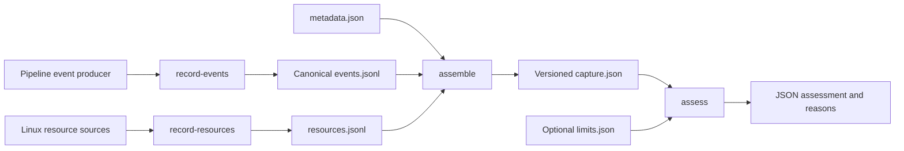
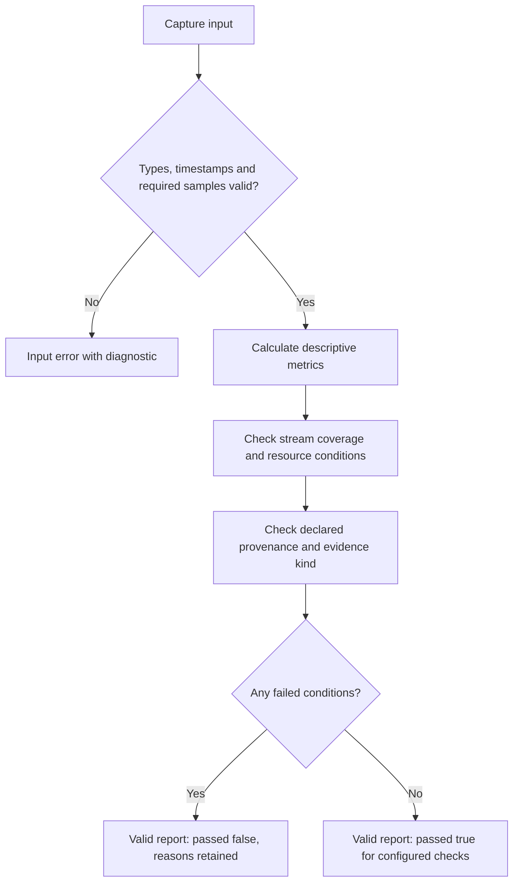

# Inside the pipeline evidence toolkit

The public software package answers a practical question: did a recorded processing pipeline maintain its timing and resource requirements for the whole capture? It combines timestamped events, host measurements and declared provenance into an inspectable result. The published implementation is a standalone observability component extracted from the wider Warden development work. It does not contain the private simulation or vehicle-control stack.

## Follow one capture through the system

There are three inputs. An event log describes when a processing stage produced a result. A resource log describes the host at intervals. A metadata document identifies the experiment, software, device and clock assumptions. Separating these inputs lets instrumentation run independently from offline analysis.



`warden-record-events` accepts JSON Lines on standard input. `warden-record-resources` collects Linux resource measurements. `warden-assemble` combines their files with metadata, then evaluates the capture. `warden-assess` evaluates an existing capture without collecting anything. The [synthetic example](examples/) exercises the offline path without a device.

## Small records, explicit meanings

The event contract has two record types:

```json
{"kind":"vio","camera_capture_ns":1000000000,"output_ns":1020000000,"valid":true}
{"kind":"command","output_ns":1021000000,"valid":true}
```

These are synthetic values. The VIO example represents a 20 ms interval between capture and output. The `command` record contains timing and validity only; it contains no actuator values or instructions.

[pi_events.py](src/warden_observability/pi_events.py) turns these objects into frozen dataclasses. Required timestamp fields must be integers, and validity must be a JSON boolean. This distinction matters in Python because `bool` is a subclass of `int`: the parser explicitly rejects `true` as a timestamp, rather than accidentally treating it as one nanosecond. It also rejects negative timestamps and VIO results dated before their associated capture.

Ordering is checked independently for each event kind. Two asynchronous producers can interleave their records, and different kinds can share an output timestamp. A duplicate or decreasing output timestamp within one kind is rejected. The writer serializes recognized fields with consistent key ordering and flushes each complete record. If a later input line is malformed, the valid prefix remains available for diagnosis.

## A capture needs context as well as samples

[pi_capture.py](src/warden_observability/pi_capture.py) reads the two UTF-8 logs, reports malformed records with line numbers, and builds a versioned `PiBenchmarkRun`. Input metadata uses schema version 1; the assembled capture uses version 2. Its three sample collections are VIO events, output events and resource measurements. A complete capture requires at least two samples in each collection; the short JSON example above illustrates record syntax, not a complete assessment input.

The assembler calculates:

```text
SHA256(event_log_bytes + zero_byte + resource_log_bytes)
```

This identifies the exact supplied log bytes, including their formatting. It is useful when comparing an exported capture with its retained inputs. It does not authenticate who produced the logs, and it does not cover the metadata or assessment limits. Keep those files alongside the logs and report.

Provenance fields identify the device, pipeline, camera calibration, camera-to-body relationship, timestamp domain, synchronization method and power supply. The assessor checks that required identifiers are present and that synchronization is declared. Actual clock alignment and calibration still require external evidence; a populated identifier is not a measurement.

The direct capture loader applies strict scalar validation too. In particular, the string `"false"` cannot silently become a true validity or synchronization flag. Resource values must be finite, with CPU and memory utilization expressed as fractions between zero and one.

## Structural validity and a passing result are separate



[compute_gate.py](src/warden_observability/compute_gate.py) derives an event rate from the number of intervals divided by elapsed time: `(sample_count - 1) / duration`. It calculates latency from each valid VIO timestamp pair, uses a nearest-rank percentile, and checks the largest gap between valid outputs. Invalid samples remain counted and cause a non-passing result even though descriptive timing metrics use the valid subset.

Each event stream must cover the required duration itself. A short VIO burst cannot borrow the length of a much longer resource log. Stream endpoints are also compared with the resource window using the implementation’s one-second alignment tolerance. Temperature stability is summarized over the final quarter of that window.

When too few valid samples remain for a metric, the report uses `null` and an explanatory reason. It does not serialize `Infinity` as if it were an ordinary JSON measurement. The output serializer rejects non-finite values.

The default profile is scoped to Raspberry Pi 4 measurements. Numeric thresholds can be overridden explicitly, while synthetic evidence always remains non-passing. These are application measurement checks, not a flight qualification or a published NVIDIA performance result.

## Reproducibility includes failure behavior

Output files are created exclusively. Existing captures and reports are preserved, and assembly rejects a request to use the same path for both outputs. The files are not a single transactional bundle: retain partial outputs when investigating an interrupted command, then use a new output directory for the next attempt.

A valid non-passing assessment returns exit code 2 with its JSON report. Input errors also return a failure status but explain the error on stderr. Automation should inspect the report, not interpret every nonzero status as the same event.

The tests exercise causal ordering, strict booleans, duplicate timestamps, malformed JSON, raw-log hashing, incomplete stream coverage, unavailable metrics and output preservation. CLI tests run the synthetic example through recording, assembly and reassessment, checking that the reports agree. Mock Linux inputs test the resource collector’s fixed read-only command invocation; they do not establish performance on a physical Raspberry Pi.

To inspect or extend the implementation, start with the [software usage guide](README.md), [shared validators](src/warden_observability/validation.py), and [tests](tests/). Keep a new instrumented producer small: emit the documented timing records, preserve invalid outcomes, and record the context needed to interpret the timestamps later.

For the surrounding source/configuration/checkpoint packaging workflow, see [Experiment artifacts](../docs/simulation/artifact-lineage.md). The archived Pi4 measurement profile is separate from the Pi Zero2W host named in later commissioning records; the latter is not a deployment result for this standalone package.

## Interface-design records

The internal interface design work separated status, bounded tools and diagnostics. Its design profile prioritized a truthful summary of readiness and blockers, with the active-operation state kept visible across desktop, tablet and phone layouts. It specified semantic light/dark appearance, keyboard access, visible focus, reduced-motion behavior and values that remain readable without relying on colour alone.

That is a design/interaction record, separate from the standalone command-line package published here. The public adaptation preserves the information architecture and accessibility reasoning; it does not distribute the private vehicle-operation interface or its operational controls. Backend state was treated as authoritative, with client presentation explaining it rather than manufacturing readiness.

## Source basis

This public explanation is grounded in the dated project records identified in the [source records for this chapter](../results/source-records.md#chapter-software-engineering-md). The catalogue distinguishes complete notices from adapted explanations and preserves separate document versions.
