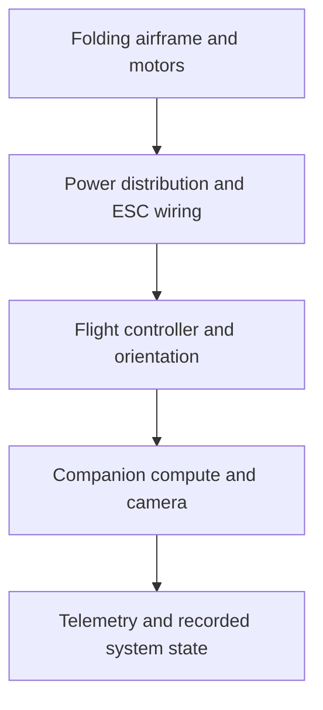

# Physical airframe and electronics

[Constantin · Takane0](https://github.com/Takane0) led the physical FPV prototype and the flight-controller/electronics integration work. The retained media shows the folding airframe, motors, wiring, electronics packaging and outdoor hover.

## Integration layers

The physical work gives the autonomy and perception software a real packaging target: the airframe must carry power electronics, flight control, compute, sensing and telemetry inside a constrained folding structure.

| View | Record |
| --- | --- |
| Assembly and wiring |  |
| Open configuration |  |
| Folded configuration |  |
| Outdoor hover |  |

The separate LL-11 package adds editable parametric landing-leg geometry, STEP/STL exchange files and digital integrity checks. See [hardware](../hardware/README.md).
