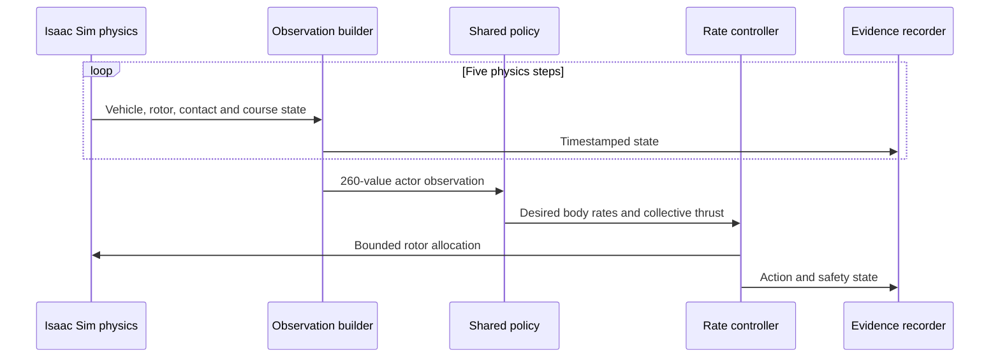
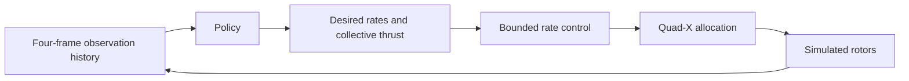

# Isaac Sim agent

Kian led the NVIDIA Brev, Isaac Sim and Isaac Lab work: simulation environment, agent interface, policy training, dynamics evaluation, telemetry, rendering and evidence preservation.

## Agent loop

The agent operates inside a repeated simulator loop. Isaac Sim advances vehicle dynamics at 250 Hz. Every five physics steps, the policy receives a new observation history and produces a bounded action at 50 Hz.

## What the agent observes

Each 65-value frame describes the simulated vehicle, rotor state and course relationship. Four frames form a 260-value temporal history for the actor. The critic receives a separate 290-value training representation with additional simulator context.

This asymmetric design keeps the actor interface compact while giving the training process richer information for value estimation.

## What the agent controls

The policy produces mass-normalized collective thrust and desired body rates. A downstream control layer converts that action into rotor commands through bounded rate control, quad-X mixing and ordered desaturation. The implementation also represents slew, motor lag and anti-windup behavior.

## How learning feedback works

The reward policy combines progress, gate crossing, clearance, alignment, control smoothness and terminal outcomes. Its shaping terms accumulate through a bounded episodic ledger. The full equation, all coefficients and the terminal-dominance proof are published in the [reward policy](../policies/reward-policy.md).

## How the agent was evaluated

The project froze source/configuration identity, scenarios and seeds before evaluation. Independent Isaac processes replayed the same cases and compared exact outputs. The completed dynamics gate covered 800 cases, 526,800 telemetry records and 400 exact replay pairs. The scale profile ran 15 real-Isaac jobs across five environment counts and three seeds, selecting 2,048 environments at 64,094.408 transitions per second.

The Stage 0 training package records ten accepted optimizer updates and 1,310,720 accepted policy transitions from one shared policy across 2,048 environments.

## What readers can inspect

- [Observation and action contracts](../policies/observation-action-contracts.md)
- [Evaluation methodology](../policies/evaluation-methodology.md)
- [Verified result table](../results/README.md)
- [Run identities](../results/run-identities.md)
- [Autonomous corridor flight](../media/autonomous/README.md)
- [Isaac Sim and Brev workflow](../docs/simulation.md)

Model weights, checkpoints and exported policy binaries remain closed source. Commercial and academic requests follow the [model-access policy](../licensing/model-access.md).
