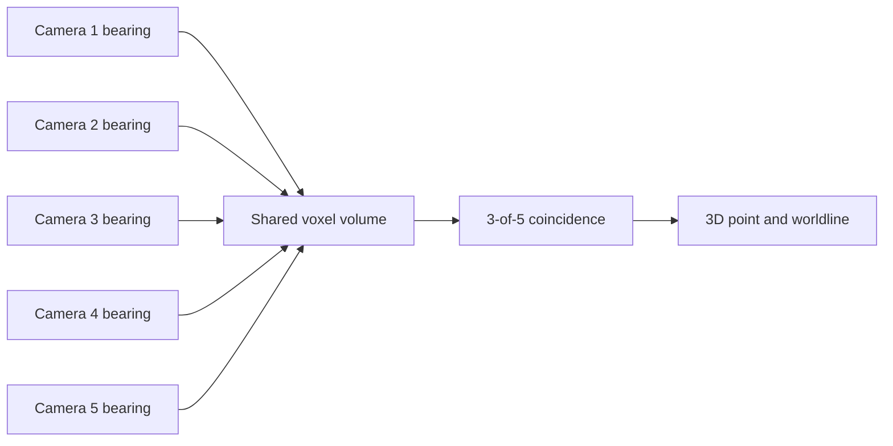
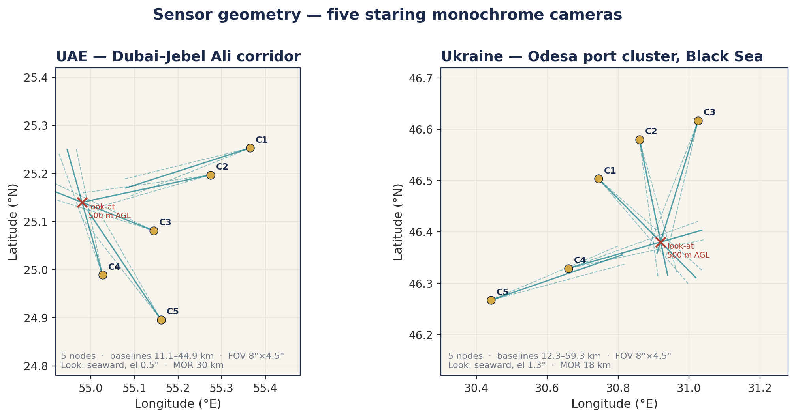
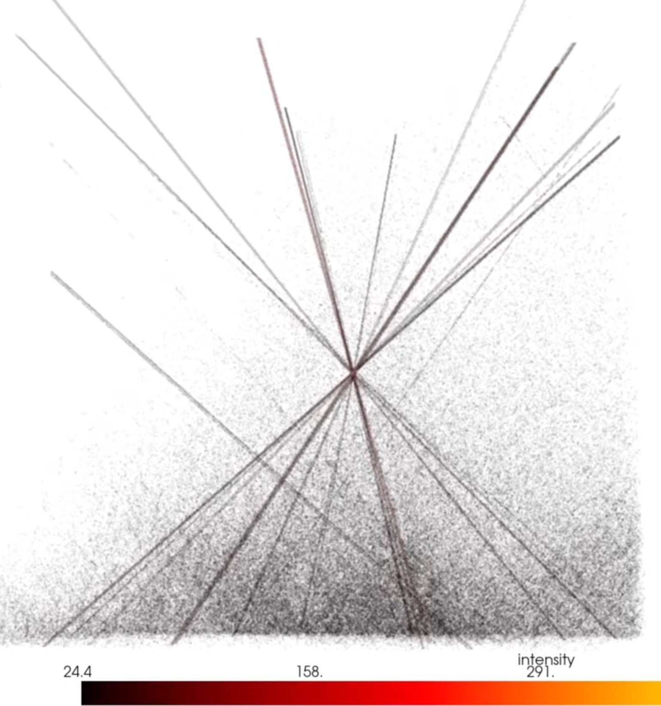
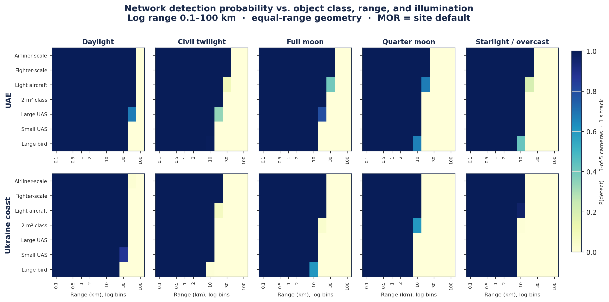

# Multi-camera sensing study

Leon developed and presented the related **Warden Corps** multi-camera sensing study. Warden Corps is a separate sensing concept under Annihilation Industries, while Warden Core is the simulation-first autonomy project documented elsewhere in this repository.

## The sensing idea

The study models five staring 4K monochrome cameras with overlapping fields of view. Each camera contributes a bearing. Coincidence across at least three views identifies a shared 3D region and supports a persistent worldline.

The model combines sensor geometry, atmospheric transmission, image noise, ground-sample distance and multi-view probability. A one-second residual stack identifies motion pixels. Sparse ray traversal follows only the voxels named by those pixels, and intersecting rays create the 3D track candidate.

## From pixels to a shared point

The path-trace figure shows many camera rays meeting at one high-intensity region. The study uses this crossing as the multi-view spatial estimate rather than treating one image blob as a complete 3D observation.

## Modeled camera performance

The ground-sample-distance figure relates angular sampling and slant range to the object size represented by one pixel. The probability heatmap then combines the camera and atmosphere assumptions with 3-of-5 coincidence:

These plots are outputs of the retained physics model and presentation package. They document the camera-network study and its assumptions.

## Presentation record

The reviewed public presentation extract is in [Warden Corps camera study](../presentations/warden-corps-camera-study.md). It retains Leon’s contribution and the original technical figures while focusing on sensing geometry, radiometry and multi-view tracking.
