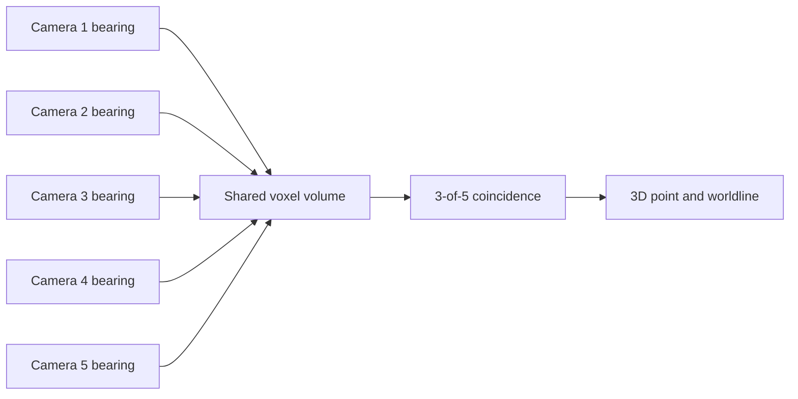
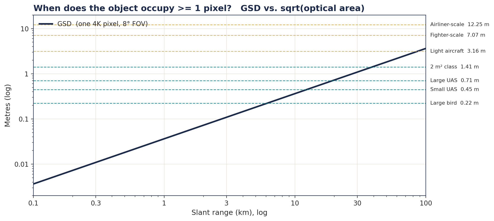

# Multi-camera sensing study

[Camera-study presentation and figures](presentation/camera-study.md) · [Figure manifest](presentation/assets-manifest.json) · [Rights exclusions](../../licensing/contributors-and-rights.md)

Leon developed and presented the related **Warden Corps** multi-camera sensing study. Warden Corps is a separate sensing concept under Annihilation Industries, while Warden Core is the simulation-first autonomy project documented elsewhere in this repository.

## The sensing idea

The study models five staring 4K monochrome cameras with overlapping fields of view. Each camera contributes a bearing. Coincidence across at least three views identifies a shared 3D region and supports a persistent worldline.

The model combines sensor geometry, atmospheric transmission, image noise, ground-sample distance and multi-view probability. A one-second residual stack identifies motion pixels. Sparse ray traversal follows only the voxels named by those pixels, and intersecting rays create the 3D track candidate.

## From pixels to a shared point

The path-trace figure shows many camera rays meeting at one high-intensity region. The study uses this crossing as the multi-view spatial estimate rather than treating one image blob as a complete 3D observation.

## Modeled camera performance

The ground-sample-distance figure relates angular sampling and slant range to the object size represented by one pixel. The probability heatmap then combines the camera and atmosphere assumptions with 3-of-5 coincidence:

These plots are outputs of the retained physics model and presentation package. They document the camera-network study and its assumptions.

## Presentation record

The reviewed public presentation extract is in [Warden Corps camera study](presentation/camera-study.md). It retains Leon’s contribution and the original technical figures while focusing on sensing geometry, radiometry and multi-view tracking.

## Contribution, package and limits

Leon’s related work includes the sensing-study direction, technical briefing, plots, presentation revisions and business/valuation presentation records. The preserved technical package includes methods, numerical summaries, figures and a separate synthetic tracking prototype. This public chapter documents that work without importing the full private study or its operational planning.

The methods explicitly state that the tracking prototype is **not wired into the camera signal-to-noise calculation**. Therefore the figures, modeled probabilities and synthetic worldlines must not be described as one validated end-to-end system. Equal-range model outputs also do not establish geographic coverage or measured field performance.

The historical valuation and investor decks are presentation work, not verified sales, contracts, funding or deployed capacity. The public presentation is a reviewed extract, not the complete original deck. Leon’s underlying figures retain the [separate rights exclusion](../../licensing/contributors-and-rights.md).

[Team contribution record](../../project/team.md) · [Unfinished work](../../project/history.md) · [Source catalogue](../../project/evidence/source-records.md)
