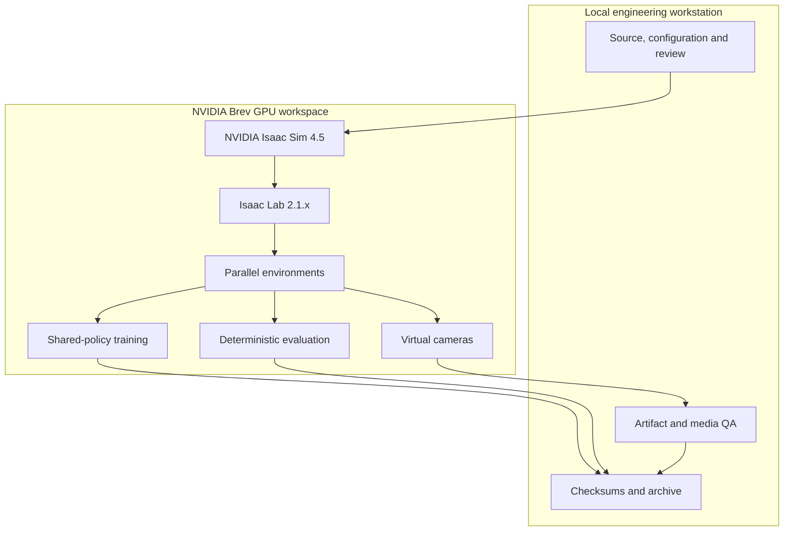
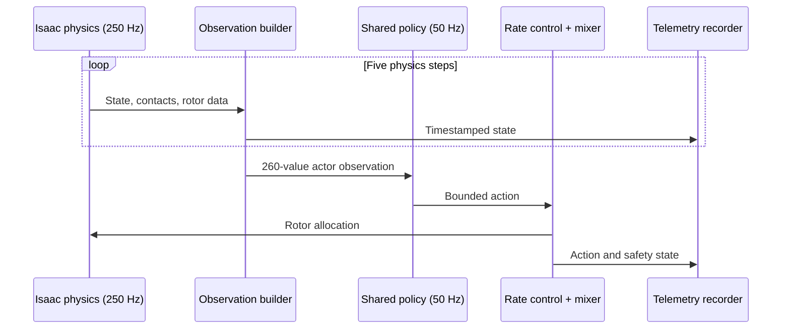
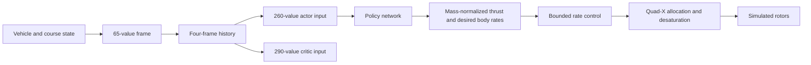
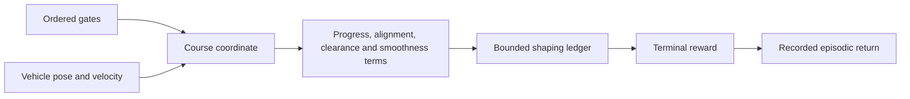

# Warden Core system architecture

Warden Core was developed as a layered robotics system: cloud GPU infrastructure runs large parallel simulations, Isaac Sim supplies the physical scene and sensors, the policy/control stack turns observations into bounded vehicle actions, and the evidence layer records what happened.

## Platform architecture

The remote workspace provided the NVIDIA GPU, simulator runtime and parallel execution capacity. The local workstation handled source preparation, review and durable preservation. Run identity and content hashes connected both sides.

## Simulation and control loop

The verified runtime used a 250 Hz physics loop and a 50 Hz policy loop. Five physics steps therefore occur for every policy decision.

The actor and critic have separate information contracts. The actor consumes a 260-value history built from four 65-value frames. The critic receives a 290-value representation with additional training-time context. This asymmetric structure lets the training system use richer simulator information while keeping the deployed policy input contract compact.

## Observation-to-action path

The controller includes anti-windup, slew limits, motor lag and ordered desaturation. The Phase C qualification exercised this path over 800 cases and exact replay in fresh Isaac processes.

## Course and reward structure

The course representation tracks ordered gate progress, directed crossing and collision-aware clearance. Dense shaping is accumulated in a bounded episodic ledger; valid completion and invalid terminal outcomes are separated by terminal terms. The exact formula and coefficient table are published in the [reward-policy chapter](../reward-and-evaluation/reward-policy.md).

## Evidence and reproducibility layer

Every major stage emits artifacts with explicit identity:

| Layer | Recorded artifacts |
| --- | --- |
| Source | Git revision, tree identity, component hashes |
| Experiment | Frozen configuration, seed, environment count, runtime versions |
| Runtime | Telemetry, metrics, contact state, camera frames |
| Learning | Update records, checkpoint index, closed-source policy state |
| Evaluation | Scenario summaries, replay comparison, aggregate metrics |
| Media | Source run, encode properties, representative frames, visual review |
| Delivery | Relative-file checksums, manifests and immutable package ledgers |

This structure supported exact replay comparison, independent media review and recovery of interrupted cloud work. The [experiment-artifact chapter](artifact-lineage.md) explains the packaging mechanics, and [verified engineering results](../../../project/evidence/README.md) collects the completed numerical outcomes.

## Public and private boundary

The public repository contains architecture, interfaces, mathematical policy documentation, runnable observability tools and selected verified media. Model weights remain closed source under the [model-access policy](../../../licensing/model-access.md). Upstream simulator and robot assets retain their own licences and notices in [`third_party/`](../../../licensing/third-party/README.md).
