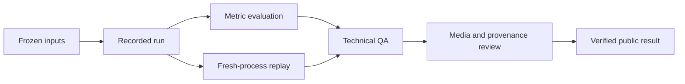

# Evaluation methodology

Warden Core separates configuration, execution, evaluation and publication so every public result has an identifiable scope and source.

## Frozen evaluation inputs

Each evaluation binds a source revision, configuration, runtime identity, scenario set and seeds before metrics are interpreted. The Phase C qualification used 800 frozen scenario/seed cases.

## Fresh-process replay

Determinism is checked across independent Isaac processes instead of replaying only within one live session. The completed Phase C result used two fresh 400-lane processes and produced 400 exact replay pairs over 526,800 telemetry records.

## Required checks

The evaluation record includes:

- finite state and action checks;
- expected scenario and seed coverage;
- exact telemetry counts;
- mixer sign and desaturation-priority checks;
- collision/contact and flight-volume state;
- recovery, saturation and response aggregates;
- replay comparison; and
- source, configuration and checksum identities.

## Media review

Published videos are checked separately for container/codec, dimensions, frame rate, frame count, full decode, representative frames, visible motion and provenance. The media manifest binds each published video to its SHA-256 identity.

[Verified results](../../../project/evidence/README.md) lists the completed outcomes. [Run identities](../results/run-identities.md) provides their durable IDs.
